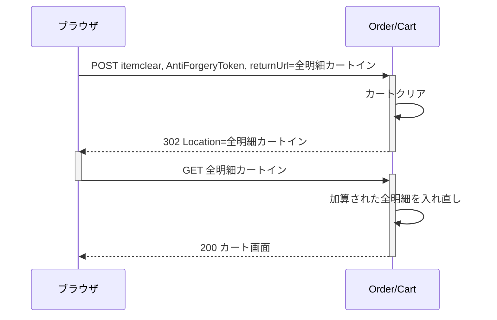
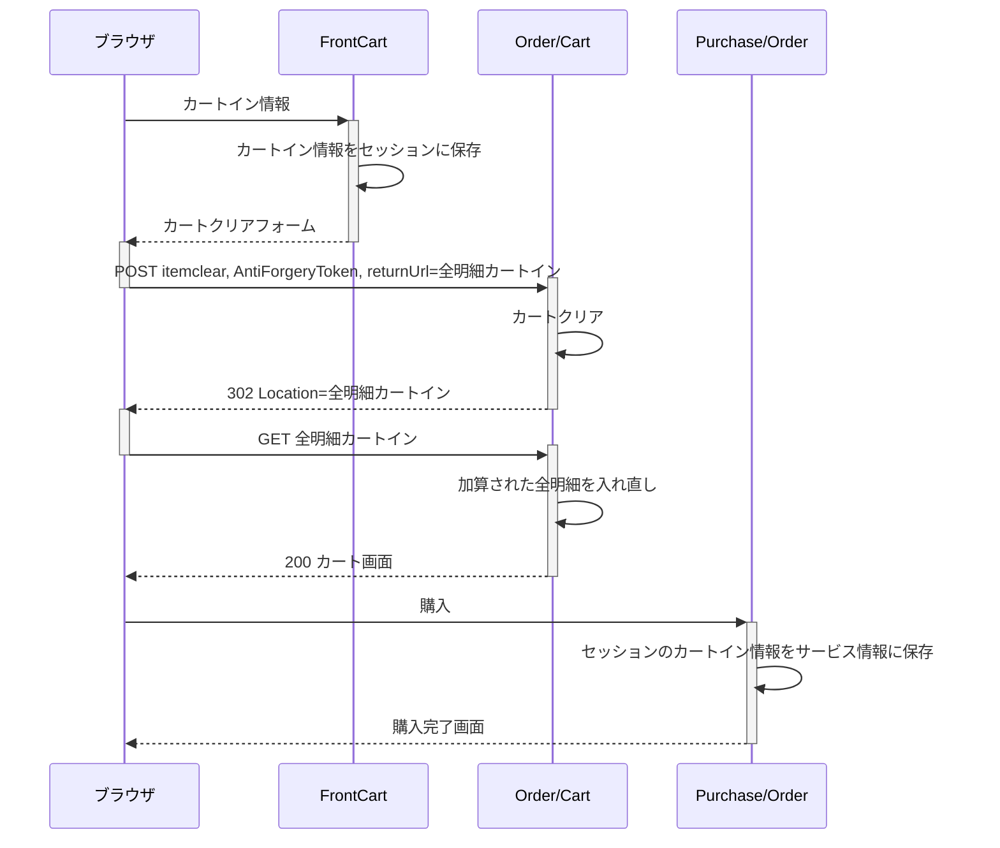

この章では、商品にオプションを付けてカートインできるECサイトを構築するときのカスタマイズについて説明します。

## オプション商品

商品にオプションを付けてカートインをさせたい時、オプションに価格がある場合は、オプションを商品として扱う必要があります。

Commerbleでは複数商品の同時カートインに対応しているため、商品とオプション商品を同時にカートイン差せることができます。

ただし、同じ商品を異なるオプション商品で購入させたい、もしくは、異なる商品を同じオプション商品で購入させたい場合は、Commerbleのカートイン仕様に注意する必要があります。

## カートインの標準仕様

Commerbleのカートイン仕様を下図に示します。

Commerbleのカートは商品IDが明細において一意である必要があります。 同じ商品を複数回カートインした場合、最初のカートインの個数が採用されます。つまり、カート内にある商品は追加でカートインすることはできません。

個数変更をする場合は、カート画面で明示的に個数変更をする必要があります。

このカートイン仕様は不変であり変更はできません。つまり、同じ商品を異なるオプション商品で購入させたい場合は、この仕様の上に実現できる方法を考える必要があります。

## カスタマイズ実績1 加算方式

テンプレートを[セルフカスタム]することによって、既にカートイン済みの商品を新たにカートインした際に、その個数分加算させるように変更可能です。

ただし、明細の備考欄を使用する場合は注意が必要です。 複数のカートインで別々の備考を付けてカートインした場合、どちらかを採用するか、もしくは、文字列結合し両方を採用するかを決める必要があります。文字列結合する場合は、個数の内訳をどうするかや、備考の文字列制限も考慮する必要があります。

このカスタムを実現するには、カートインの前に、カート内のすべての明細をクリアし、対象商品加算された明細データを丸ごと入れなおす必要があります。

## カスタマイズ実績2 フロントカート方式

加算方法式カスタマイズに加えて、セッションにカートイン情報を保持することによって、カートインごとに明細が分離されたフロントカートを作成できます。 また、フロントカートデータを受注サービス情報に保存することで履歴ページでもカートインごとに明細が分離されたフロントカートを再現できます。

ただし、カスタマーサポートで明細キャンセルを提供している場合は注意が必要です。管理画面から表示・変更できる明細は、標準仕様に則り、商品IDで一意にまとめられたデータです。これらの明細を変更しても、フロントカート情報を変更するにはサービス情報も変更が必要です。変更点が2つになりオペレーションの実行が困難になります。　これらを透過的に実行するには、Web APIを用いてカスタム管理画面を作成する必要があります。

[セルフカスタム]: ../../features/customization/#セルフカスタム "セルフカスタム"