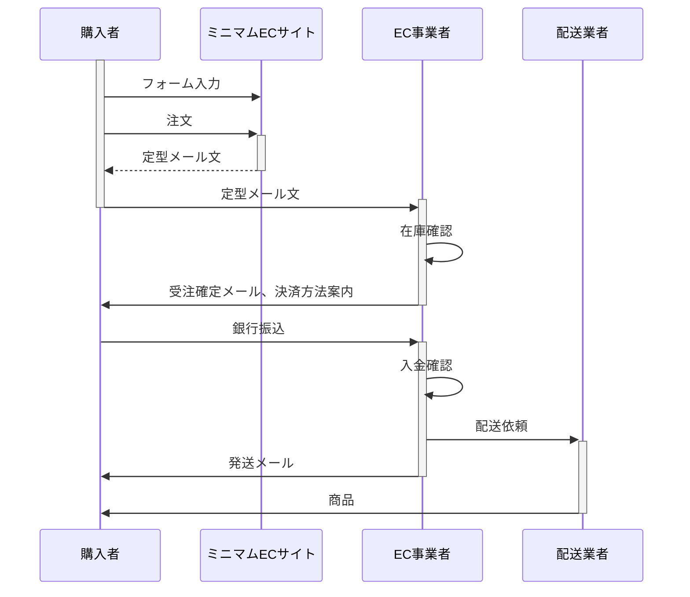

この章では、ECシステム全体の中でのCommerbleの位置付け、システムスコープについて説明します。

## ECシステム
世の中には多種多様な商いの形があり、それと同様にECシステムにも様々な形があります。そのため、様々なECプラットフォームは似通った機能がありつつも一様というわけではありません。
また、それらの統一仕様の策定などの活動もこれまでは活発ではありませんでした。[ISO/TC 321][isotc321]などがはじまりつつも、ECシステム全体を規定するものではありません。また、業界全体がそのような仕様に従う未来はかなり遠いものとなりそうです。
したがって、一口にECシステムと言っても、二者間で同一の認識を持つことは難しいのが現実です。
そういった齟齬の発生を抑えるため、ここでは、Commerbleのシステムスコープの説明に進む前に、ECシステム全体を考察し、ECシステムの認識をすり合わせることとします。

### 前提
電子商取引の歴史を遡るとその原点は、金融取引の売買や、飛行機のチケットシステムや、企業間の受発注システムなどのB2B取引にあります。
しかし、ここでは現在広く一般的なECの利用から考えて、EC=消費者向け電子商取引を前提に進めていきます。

{}
要出典
{}

### 最小のECシステム

まず初めにECシステムと言える最小の仕組みを考えてみましょう。

[経済産業省:省消費者向け電子商取引の定義(PDF)][denshi]によると消費者向け電子商取引は以下のように定義されています。

- 商取引（＝企業（個人事業者も含む）の収益として計上された金銭的対価を伴う商品としてモノ、サービス、情報の交換に関わる一連の業務・行為）のうち、一部でもコンピュータを介したネットワーク上で行われ、かつ、成約（＝確定受発注）されたもの。  
- 「一部でもコンピュータを介したネットワーク上で行われる」取引形態とは、パソコン等の画面を通じて注文及び承諾が行われた場合をいう。ただし、受発注がコンピュータネットワークシステムを介して行われることが条件となり、電子メールによる受発注のうち定型フォーマットによらないものは含まない。  
- なお、支払いについては、必ずしもコンピュータネットワークシステムを介する必要はないものとする。  

{}
経済産業省による定義はあくまで経済産業省が電子商取引を調査する上でのカウント対象を定義しているものです。  
この定義は絶対のものありませんので、当てはまらないこともあります。また未来永劫不変のものでもありません。
{}

以上の3つの特徴から考えて最小の仕組みで作成したECサイトの例を以下に示します。

<div style="padding:16px; background:#eee;">
    <h4>ミニマムECサイト</h4>
    <table>
        <thead>
            <tr><th>商品名</th><th>税込単価</th><th>数量</th><th>小計</th></tr>
        </thead>
        <tbody style="border-top: solid;">
            <tr class="item" data-name="商品A" data-price="1000"><td>商品A</td><td>1000円</td><td><input type="integer" size="1" value="1" onchange="minimum_update()"></td><td>0円</td></tr>
            <tr class="item" data-name="商品B" data-price="1200"><td>商品B</td><td>1200円</td><td><input type="integer" size="1" value="2" onchange="minimum_update()"></td><td>0円</td></tr>
            <tr class="item" data-name="商品C" data-price="1500"><td>商品C</td><td>1500円</td><td><input type="integer" size="1" value="0" onchange="minimum_update()"></td><td>0円</td></tr>
        </tbody>
        <tfoot style="border-top: solid;">
            <tr><td colspan="3" align="right">合計</td><td class="total">0円</td></tr>
        </tfoot>
    </table>
    <div class="customer">
        <table>
            <caption>購入者情報</caption>
            <tr><th>氏名</th><td><input size="12" value="Commerble"></td></tr>
            <tr><th>〒</th><td><input type="phone" maxlength="7" size="7" value="1030014"></td></tr>
            <tr><th>住所</th><td><input value="東京都中央区日本橋蛎殻町1-12-9-3"></td></tr>
            <tr><th>電話番号</th><td><input type="phone" maxlength="11" size="11" value="0366611334"></td></tr>
        </table>
    </div>
    <div class="destination">
        <table>
            <caption>お届け先</caption>
            <tr><th>氏名</th><td><input size="12" value="Commerble"></td></tr>
            <tr><th>〒</th><td><input type="phone" maxlength="7" size="7" value="1030014"></td></tr>
            <tr><th>住所</th><td><input value="東京都中央区日本橋蛎殻町1-12-9-3"></td></tr>
            <tr><th>電話番号</th><td><input type="phone" maxlength="11" size="11" value="0366611334"></td></tr>
        </table>
    </div>
    <a class="orderlink" style="display:inline-block; width:320px; padding:8px; text-align:center; border: solid #8440f1;" href="mailto:order@commerble.com"  target="_blank">注文</a>
    <script>
        function minimum_update() {
            const href = 'mailto:order@commerble.com?subject=注文&body='
            let body = '注文内容:\n'
            let total = 0
            for(let item of document.querySelectorAll('.item')) {
                const name = item.dataset.name;
                const price = item.dataset.price - 0;
                const qty = item.querySelector('input').value;
                console.log(name, price, qty)
                total += price * qty
                item.children[3].innerText = price * qty + '円'
                body += name + ' ' + qty + '個\n'
            }
            document.querySelector('.total').innerText = total + '円'
            body += '合計: ' + total + '円\n'
            body += '\n購入者情報\n'
            for(let input of document.querySelectorAll('.customer input')) {
                body += input.value + '\n'
            }
            body += '\nお届け先\n'
            for(let input of document.querySelectorAll('.destination input')) {
                body += input.value + '\n'
            }
            document.querySelector('.orderlink').setAttribute('href', href + encodeURI(body))
        }
        minimum_update();
    </script>
</div>

このミニマムECサイトでは、注文ボタンを押すとメーラーが起動し、フォームの内容から注文内容が以下のような定型文として作成されます。購入者はこの定型文のメールを送信することで注文します。

```
To: order@commerble.com
Subject: 注文
Body:
注文内容:
商品A 1個
商品B 2個
商品C 0個
合計: 3400円

購入者情報
Commerble
1030014
東京都中央区日本橋蛎殻町1-12-9-3
0366611334

お届け先
Commerble
1030014
東京都中央区日本橋蛎殻町1-12-9-3
0366611334
```

先の経済産業省の定義に照らし合わせ見ましょう。定義によると、定型フォーマット以外のメール注文は電子商取引に含まれませんが、上記の例のミニマムECサイトは定型メールで注文するため問題ありません。
また、支払いは、コンピュータネットワークを介さなくとも良いということですので考慮不要です。
上記の例で唯一満たしていないのは、**成約されたもの**という条件です。なぜなら、上記の例のミニマムECサイトは定型メールで注文のリクエストを行ったのみであり、成約には至っておりません。

これをカバーするために、ECサイトの外側、つまりECシステム全体について考えます。

上記のミニマムECサイトで商品が購入者に届くまでには次のようなフローになるでしょう。



ここまで定めることでEC事業者が購入者に受注確定メールを送った際に受注が制約されることがわかります。
ミニマムECサイト単体では定義を満たしませんが、ECシステム全体では定義を満たしています。ECサイトがその一部分をになうだけで電子商取引になるかどうかは定義の **一部でもコンピュータを介したネットワーク上で行われ…** とあるので問題ないでしょう。

以上が、経済産業省の定義に沿った、最小のECサイトを使用した最小のECシステムの一例です。


### 最小のECサイト
最小のECシステムで考えた最小のECサイトについてまとめます。最小のECサイトが提供する機能は、購入者が何をどのくらい欲しいのかEC事業者に伝える事ができる1点のみです。購入希望者が販売者に購入の意思表示ができるシステムといえます。

これは、同時に確約能力がないということでもあります。例えば、注文リクエスト送信後にも以下のような理由により注文が成約に至らない可能性があります。

- 欲しい個数分在庫がない
- すぐには配送できない
- 購入者希望者に決済能力がない

最小のECサイトでは受注の成約はECサイトの外側で成立します。

### 確約可能なECサイト

最小のECサイトを出発点とし、より便利なECサイトを考えます。まず最初に補強すべきは、確約能力です。つまり、購入確定ボタンを押した時点で受注が成約されるECサイトです。

この能力を実現するには、受注リクエストを受け取った際に、機械的に受注できるか否かが判定できる必要があります。

その可否を判断するには、以下のような項目をすべてチェックする必要があります。

- 販売可能数(在庫数) >= 購入希望数
- 送料、手数料を含めて価格が決定できる
- 配送可能な場所である
- 配送日時が現実的である
- 与信が通る、与信がなくても買える決済方法である
- 購入者がブロックリスト（ブラックリスト）に載ってない

これらを実現するためには、ECサイトで在庫を持っておき、注文ごとに在庫を更新し続ける在庫処理や商品の配送リードタイムなどの計算処理が必要になります。

もちろんこれらは、今日のECパッケージ等では一般的に備わっている機能です。

### 追跡可能なECサイト

配送前なのか配送中なのか、配送会社及び配送番号はいくつなのか、受注のキャンセルは可能かなどの受注の進行状況が確認できることが望まれる場合もあります。

いくつか方法がありますが、対応方法によっては会員システムなどの購入者の証明がとれる仕組みをつくる必要があります。

- 状態が変わったことを通知する
  + 配送した時にメールで送る
- 状態をWebショップで表示する
  + 受注履歴を見られる必要がある
  + 会員機能などの認証や購入者である証明が取れる仕組みが必要
  + 受注の状態を保存できる必要がある
  + 受注の状態を更新・同期できる必要がある

もちろんこれらは、今日のECパッケージ等で一般的に備わっている機能です。

### 必要なECサイト

2020年代の現代に要求されるECサイトの能力は、確約可能かつ追跡可能なECサイトでは無いでしょうか。

もちろん、多彩な商品検索・レコメンド・オムニチャネルなど細分化すると様々な要求される機能があります。ですが、電子商取引を購入者とEC事業者の間で取引の合意をとるためのものと見たときに上記の2項目が最重要です。

この観点から広い視野でみると、ECサイトは電子契約サービスと同様の合意ツールとしての性質があると言えるでしょう。

最小のECサイトから真に使用できるに足るECサイトにするための下記のような機能追加は、いわば注文ボタンを押した際にどこまで合意形成するかの境界線とも捉えることができます。

+ 購入の意思の確認 (最小のECサイト)
+ 取引数量の合意
+ 取引金額の合意
+ 決済方法の合意
+ 配送日の合意

### 必要なECシステム

ECサイトが購入者とEC事業者間の合意形成ツールであることが確認できました。それではそのECサイトを起点にECシステム全体を考えてみましょう。

最小のECシステムの節ではECシステムの中でも出荷までにかかわる部分だけに絞って説明しました。

しかし、注文が入ってから出荷までのフローのみがECの業務ではありません。商品の登録や発注、在庫の管理、決済の管理等多岐にわたります。

これらの業務をすべて手作業で行うのは、現実的ではありませんので、適度に必要なものを費用対効果の大きい順でアプリケーション化するとよいでしょう。

主にECシステムを構成するアプリケーション群を下図に示します。


購入者は、Webショップ、会員サイト、場合によっては決済代行を使用して注文を作成します。作成された注文は受注管理でCS（カスタマーサポート）チームによって管理されます。また、会員情報や決済情報も同様にそれぞれの管理アプリケーションでCSチームによって管理されます。

入金・与信などが確認でき、出荷業務へ移った受注は、出荷データとして倉庫を管理する在庫管理アプリケーションに連携されます。これらはロジチームによって管理され、出荷後、出荷実績を受注管理と連携します。

Webショップ・受注管理・在庫管理では一意に商品を扱う必要があるため、それらを管理する商品管理が必要となります。これらは、必要なアプリケーションに商品データを連携します。また、商品管理は、商品企画業務を伴う販促チームが取り扱います。販促チームはさらにWebショップの商品ページなどを作成すつためにWeb管理を使用します。商品企画チームと販促チームが別々の場合ももちろん考えられます。

現在、図示したアプリケーションが1つ一つ独立したアプリケーションになっていることは少ないと思われますが、それらは本質的にはデータや業務に境界線があり、別々の機能です。例えば、決済代行の売上確定などの管理処理が受注管理画面から使用できるように提供しているサービスがあります。これは受注管理と決済管理を同一のインターフェイスで提供しているに過ぎず、インターフェイスの裏側を考えると一種のマイクロサービスになっています。

ECシステムと一言で表すとあたかも単一のソフトウェアのような印象として伝わってしまうことが多くあります。しかし、実際のECシステムには多くの業務ドメインがあり、それを実行するチームがそれぞれにあり、それを実現するアプリケーション群によって成り立っています。

## Commerbleのシステムスコープ

前節ではECシステムについて共通理解を作りました。この節では、Commerbleのシステムスコープはどこまでか、それぞれどこまでできるのかを解説します。

### Commerbleがカバーする範囲

ECシステム上でカバーする範囲を下図に示します。黄色枠で囲まれた部分が提供範囲になります。


### Webショップ

Commerbleでは完全なカート機能とカスタム可能なWEBページ機能を提供します。これらは一般的にECサイトに必要とされるすべての機能を提供しているわけではないことに注意が必要です。例えば、大量の商品の検索、あいまい検索、レコメンド等の機能は提供していないため、他の専用サービスを導入する必要があります。Commerbleはこれらの他サービスの多くを連携可能です。必要なサービスの連携可否はお問い合わせください。

### Web管理

Commerble内でホストされるWebページの範囲のみ、完全な管理が可能です。外部検索サービスのメタデータ連携などのCommerble外の管理は提供しておりません。

### 受注管理

Commerbleでは受注データの細部まで編集可能な管理画面を提供しています。しかし、明細キャンセルによる合計額の再計算やキャンペーンのあてなおしなどの業務ロジックが伴う操作には提供しておりません。これらは[Web API][api]を利用することで専用業務画面を作成可能です。

### 会員サイト

Commerbleは会員機能を有します。ただし、会員のプロパティはカスタマイズできません。また、認証方法もID＋パスワードのみとなります。
会員の独自のプロパティを作り、属性を収集したい場合やSNS認証などのカスタム認証を使用したい場合は、別途会員サイトを作成していただき、会員連携する必要があります。詳しくは、お問い合わせください。

また、会員使用せずゲスト購入も可能です。

### 会員管理

Commerbleの会員情報のみ管理可能です。専用会員サイトと連携している場合はCommerbleの会員管理から直接操作できません。

### 商品管理

Commerble内で使用される商品情報の範囲のみ、完全な管理が可能です。Commerbleでの商品の表現範囲を超える用途での管理には[Web API][api]を利用して別途管理画面を作成していただくことでご利用いただけます。

### 在庫管理

Commerbleでは販売可能数、配送可能数、倉庫在庫数、B品数などの数値を管理できます。Commerbleで販売しない商品の管理はできません。また、ピッキングツールからの直接連携は提供しておりませんので、倉庫業務の専用サービスのご利用をご検討ください。それらの倉庫サービスとは[Web API][api]を利用して連携可能です。

### 決済代行

Commerbleでは決済代行機能を提供して折りませんので、別途利用したい決済代行会社とご契約していただく必要があります。連携実績はお問い合わせください。
Webショップでの注文の際に、決済代行が提供するAPIを利用し、決済代行の取引登録や与信をとることが可能です。

### 決済管理

Commebleでは決済代行の管理機能を提供しておりません。キャンセルや決済額の変更の際は、各決済代行会社が提供する管理画面をご利用ください。

[Web API][api]を利用することでキャンセル連携などが実現可能です。

[isotc321]: https://www.iso.org/committee/7145156.html "Transaction assurance in E-commerce"
[denshi]: https://www.meti.go.jp/statistics/tyo/denshi/pdf/21yougo.pdf "消費者向け電子商取引の定義"
[metisearch]: https://www.meti.go.jp/press/2019/05/20190516002/20190516002-1.pdf "平成 30 年度 我が国におけるデータ駆動型社会に係る基盤整備（電子商取引に関する市場調査）"
[api]: ../../development/webapi/ "接続性"