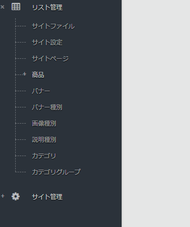
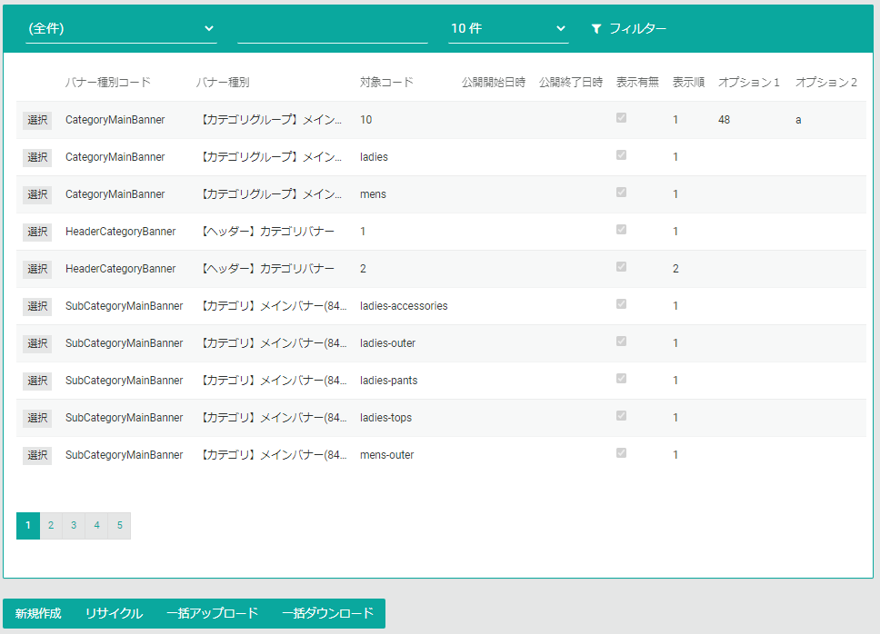
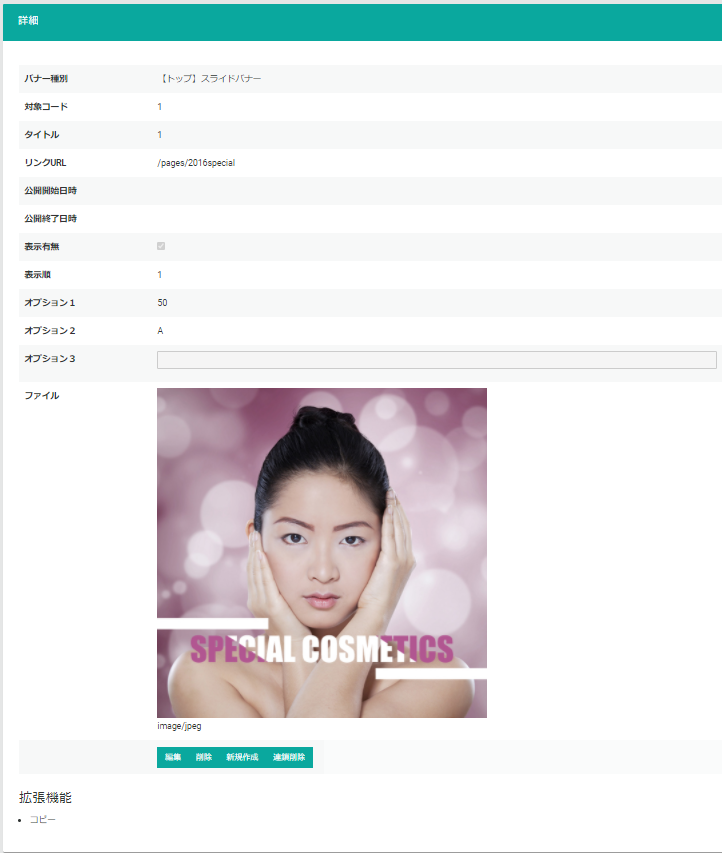
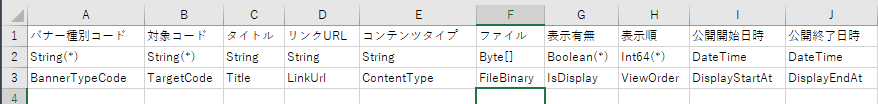
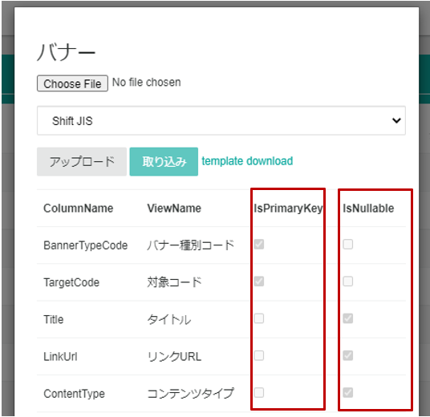

# リスト管理
リストとは[CMSデータ](../../../../development/data/cms)として定義したデータのことです。
リスト管理ページでは、このリストの管理を行います。  
[CMSデータ](../../../../development/data/cms)はテナントのシステム要件に応じて自由に設計できるデータです。

## リスト一覧（メニュー）
定義済のリストの一覧がメニューに表示されます。  
下記の画像はサンプルECサイトのリスト一覧になります。テナントによりリスト一覧は異なります。  

## CMSデータ一覧
リスト一覧より管理するCMSデータを選択するとCMSデータ一覧が表示されます。

**新規作成**ボタン押下すると新規にデータを登録することができます。

**リサイクル**ボタン押下すると過去に削除したデータを復元する画面が表示されます。
誤ってデータを削除してしまった場合などに利用します。但し復元できる削除データは直近200件のデータのみとなります。

**一括アップロード**ボタンを押下するとデータを一括アップロードする画面が表示されます。詳細は[一括アップロード](./#一括アップロードcsv)をご参照ください。

**一括ダウンロード**ボタンを押下すると、データをCSV形式でダウンロードすることができます。
こちらでダウンロードしたCSVは[一括アップロード](./#一括アップロードcsv)するCSVと同様の形式になります。
ダウンロードデータをフィルターする場合は、一覧で条件を指定してフィルターしてから**一括ダウンロード**を行ってください。

## CMSデータ詳細
一覧で選択したデータが**一覧の下部**に表示されます。

**編集**ボタンを押下すると表示しているデータを編集できます。

**削除**ボタンを押下すると表示しているデータを削除します。

**新規作成**ボタンを押下するとデータを新規登録できます。

**連鎖削除**ボタンを押下すると表示しているデータを削除する際に、このデータと関連した他のCMSデータを一緒に削除します。

**拡張機能:コピー**リンクを押下すると表示しているデータを元に、データを新規登録できます。

## 一括アップロード（CSV）
CMSデータをCSVをアップロードして一括登録します。
ここでは登録するデータを、CSV形式のファイルでアップロードします。  
Blob(Binary Large Object)を含むデータを一括登録する場合は、[一括アップロード（圧縮ファイル）](./#一括アップロード圧縮ファイル)をご参照ください。

以下は**一括アップロード**ボタンを押下したときに表示されるアップロード画面です。

### 一括アップロードの手順
1. **template download**リンクより、一括CSVアップロードのテンプレートファイルをダウンロードします。
2. CSVファイルを作成します。
3. **Choose File**ボタンからアップロードするファイルを選択、**アップロード**ボタンよりファイルをアップロードします。*この段階ではまだ登録はされません。*
4. アップロードされたデータに問題がある場合エラーが表示されます。エラーがない場合は、**取り込み**ボタンからデータ登録します。

### CSVファイルのルール
アップロードするCSVファイルにはいくつかルールがあります。

**ヘッダー列は必ず３行必要**  
１行目はCMSデータのフィールドの表示名、２行目は型、３行目は列名になります。  
**template download**リンクよりダウンロードできるテンプレートには上記３行が含まれています。

**CSVの列は可変。但し主キーの列は必須**  
CSVファイルに用意する列は必ずしも全てのフィールドを用意する必要はありません。  
必ず必要な列は、データを一意に識別する主キーとなるフィールドです。データを新規登録する場合は、入力必須のフィールドの列も必要です。  
- **主キー**: **IsPrimaryKey** がチェックされている
- **入力必須**: **IsNullable** がチェックされていない

**未登録→新規登録。登録済→更新**  
アップロードするCSVデータが、Commerbleに未登録の場合は新規登録されます。Commerbleに登録済の場合は更新されます。

## 一括アップロード（圧縮ファイル）

