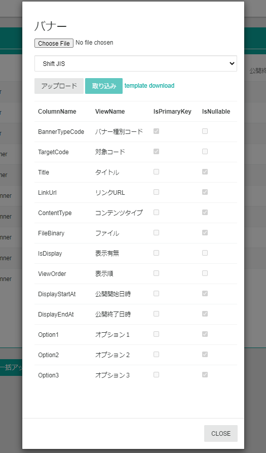

# リスト管理
リストとは[CMSデータ](../../../../development/data/cms)として定義したデータのことです。
リスト管理ページでは、このリストの管理を行います。  
[CMSデータ](../../../../development/data/cms)はテナントのシステム要件に応じて自由に設計できるデータです。

## リスト一覧（メニュー）
定義済のリストの一覧がメニューに表示されます。  
下記の画像はサンプルECサイトのリスト一覧になります。テナントによりリスト一覧は異なります。  

## CMSデータ一覧
リスト一覧より管理するCMSデータを選択するとCMSデータ一覧が表示されます。

**新規作成**ボタン押下すると新規にデータを登録することができます。

**リサイクル**ボタン押下すると過去に削除したデータを復元する画面が表示されます。
誤ってデータを削除してしまった場合などに利用します。但し復元できる削除データは直近200件のデータのみとなります。

**一括アップロード**ボタンを押下するとデータを一括アップロードする画面が表示されます。詳細は[一括アップロード](./#一括アップロードcsv)をご参照ください。

**一括ダウンロード**ボタンを押下すると、データをCSV形式でダウンロードすることができます。
こちらでダウンロードしたCSVは[一括アップロード](./#一括アップロードcsv)するCSVと同様の形式になります。
ダウンロードデータをフィルターする場合は、一覧で条件を指定してフィルターしてから**一括ダウンロード**を行ってください。

## CMSデータ詳細
一覧で選択したデータが**一覧の下部**に表示されます。

**編集**ボタンを押下すると表示しているデータを編集できます。

**削除**ボタンを押下すると表示しているデータを削除します。

**新規作成**ボタンを押下するとデータを新規登録できます。

**連鎖削除**ボタンを押下すると表示しているデータを削除する際に、このデータと関連した他のCMSデータを一緒に削除します。

**拡張機能:コピー**リンクを押下すると表示しているデータを元に、データを新規登録できます。

## 一括アップロード（CSV）
CMSデータをCSVをアップロードして一括登録します。
ここでは登録するデータを、CSV形式のファイルでアップロードします。  
Blob(Binary Large Object)を含むデータを一括登録する場合は、[一括アップロード（圧縮ファイル）](./#一括アップロード圧縮ファイル)をご参照ください。

以下は**一括アップロード**ボタンを押下したときに表示されるアップロード画面です。

### 一括アップロードの手順
1. **template download**リンクより、一括アップロード用のCSVテンプレートファイルをダウンロードします。
2. CSVファイルを作成します。
3. **Choose File**ボタンからアップロードするファイルを選択、**アップロード**ボタンよりファイルをアップロードします。*この段階ではまだ登録はされません。*
4. アップロードされたデータに問題がある場合エラーが表示されます。エラーがない場合は、**取り込み**ボタンからデータ登録します。

### CSVファイルのルール
アップロードするCSVファイルにはいくつかルールがあります。

**ヘッダー列は必ず３行必要**  
１行目はCMSデータのフィールドの表示名、２行目は型、３行目は列名になります。  
**template download**リンクよりダウンロードできるCSVテンプレートファイルには上記３行が含まれています。

**フィールドの型**  
CMSデータのフィールドの型は、**template download**リンクよりダウンロードできるCSVテンプレートファイルの2行目に記載されています。  
入力必須のフィールドの場合、`(*)` が型の後に表示されます。`Int32(*)`は、入力必須の整数の型を表します。  

| 型       | 説明   | 設定値の例                                                                                      |
|----------|--------|-------------------------------------------------------------------------------------------------|
| Boolean  | 真偽値 | `True`、`False`                                                                                     |
| Int32    | 整数   | `100`、`-100`                                                                                       |
| Int64    | 長整数 | `10000`、`-10000`                                                                                   |
| String   | 文字列 | `いろはにほへと`                                                                                  |
| DateTime | 日時   | `2016/09/20 14:08:02`、`2020/01/01`                                                                 |
| Byte[]   | Blob(バイナリファイル)   | Zip圧縮で一括アップロードをする場合に、Zip圧縮前のディレクトリのBlobファイルのパスを指定する。 `images\hero.png` |

**CSVの列は可変。但し主キーの列は必須**  
CSVファイルに用意する列は必ずしも全てのフィールドを用意する必要はありません。  
必ず必要な列は、データを一意に識別する主キーとなるフィールドです。データを新規登録する場合は、入力必須のフィールドの列も必要です。  
- **主キー**: **IsPrimaryKey** がチェックされている
- **入力必須**: **IsNullable** がチェックされていない

**未登録→新規登録。登録済→更新**  
アップロードするCSVデータが、Commerbleに未登録の場合は新規登録されます。Commerbleに登録済の場合は更新されます。

## 一括アップロード（Zip圧縮）
登録するファイルをZip圧縮してアップロードします。  
Zip圧縮アップロードは、画像やCSSのファイルを一括アップロードする際に利用します。  
アップロードの手順は、アップロードするファイル以外[一括アップロード（CSV）](./#一括アップロードcsv)と同じです。  
以下はZip圧縮するファイルの構成例です。

*Zipファイル名、ルートディレクトリ名、CSVファイル名は同じにしてください。*  
*圧縮したのディレクトリの構成に誤りがある場合、アップロードに失敗しますのでご注意ください。*

## WindowsでZip一括アップロード
クライアントマシンがWindowsの場合のアップロード方法を説明します。  
今回作成したZipファイルは、[こちら](SiteFiles.zip)よりダウンロードできます。
この例で一括アップロードするCMSデータは静的ファイルを管理するデータで、以下のスキーマとします。

| 表示名           | カラム名    | 型        | 説明                                  |
|------------------|-------------|-----------|---------------------------------------|
| ファイルタイプ   | FileType    | String(*) | ファイルの種類を保持                  |
| ファイルパス     | FilePath    | String(*) | ECサイトで公開するURLのパスを保持     |
| コンテンツタイプ | ContentType | String    | ECサイトで出力する際のmime-typeを保持 |
| ファイル         | FileBinary  | Byte[]    | Blob(バイナリデータ)を保持            |

今回は画像ファイルを2つ、CSSファイルを１つアップロードする例を説明します。

1. CSVテンプレートファイルをダウンロードします。
2. CSVファイルを編集します。以下は編集したCSVファイル(SiteFiles.csv)です。

3. アップロードするファイルを圧縮してアップロードする予定のディレクトリに集めます。  
  *ルートディレクトリの名前はCSVファイルの名前と同じ(SiteFiles)にする必要があります。*

4. ルートディレクトリをZip圧縮します。  
  *Zipファイルの名前はCSVファイルと同じ名前(SiteFiles)にする必要があります。*

5. Zipファイル(SiteFiles.zip)をアップロードします。以下はアップロード後の画面です。

6. **取り込み**ボタンを押下してデータを登録します。

## macOSでZip一括アップロード
クライアントマシンがmacOSの場合のアップロード方法を説明します。  
今回作成したZipファイルは、[こちら](SiteFiles.zip)よりダウンロードできます。
この例で一括アップロードするCMSデータは静的ファイルを管理するデータで、以下のスキーマとします。

| 表示名           | カラム名    | 型        | 説明                                  |
|------------------|-------------|-----------|---------------------------------------|
| ファイルタイプ   | FileType    | String(*) | ファイルの種類を保持                  |
| ファイルパス     | FilePath    | String(*) | ECサイトで公開するURLのパスを保持     |
| コンテンツタイプ | ContentType | String    | ECサイトで出力する際のmime-typeを保持 |
| ファイル         | FileBinary  | Byte[]    | Blob(バイナリデータ)を保持            |

今回は画像ファイルを2つ、CSSファイルを１つアップロードする例を説明します。

1. CSVテンプレートファイルをダウンロードします。
2. CSVファイルを編集します。以下は編集したCSVファイル(SiteFiles.csv)です。

3. アップロードするファイルを圧縮してアップロードする予定のディレクトリに集めます。  
  *ルートディレクトリの名前はCSVファイルの名前と同じ(SiteFiles)にする必要があります。*

4. ルートディレクトリをZip圧縮します。  
  *Zipファイルの名前はCSVファイルと同じ名前(SiteFiles)にする必要があります。*

  

5. Zipファイル(SiteFiles.zip)をアップロードします。以下はアップロード後の画面です。

6. **取り込み**ボタンを押下してデータを登録します。

