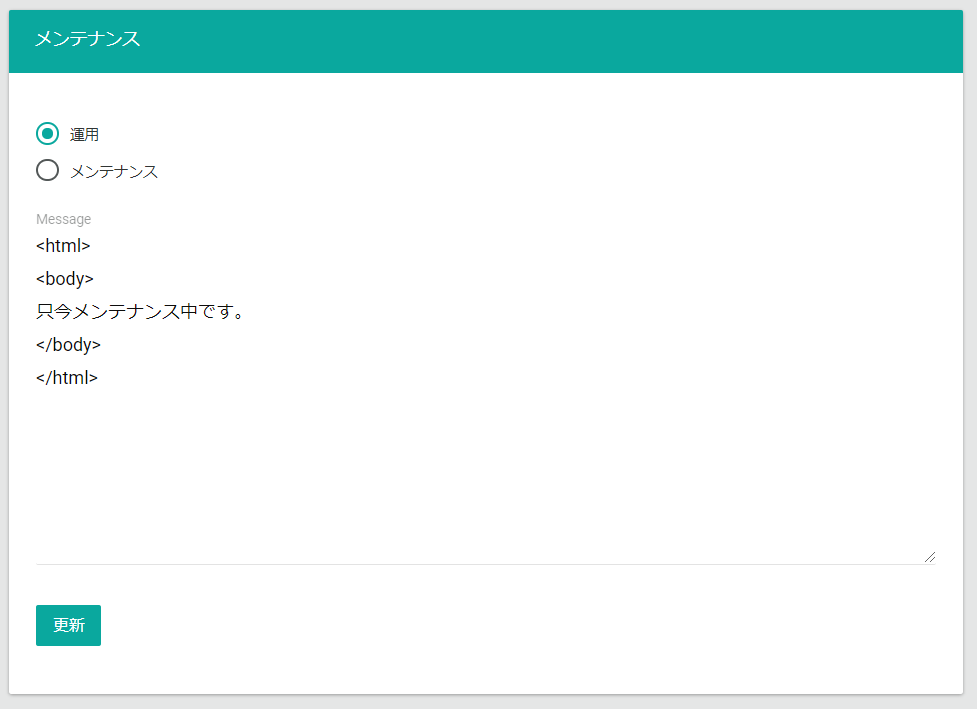

メンテナンス機能は、計画メンテナンスなど一時的にサイトを停止する場合に利用します。  
「メンテナンス」モードに切り替えると、ECサイトのページ要求の応答が全てメンテナンス用メッセージになります。

- **運用/メンテナンス**: 「運用」モードは通常通りサイトを運用するモードです。  
  「メンテナンス」モードはECサイトのページ要求の応答が**Message**に指定したテキストになります。
- **Message**: 「メンテナンス」モードの時のページ要求の応答を指定します。

**更新**ボタンを押下することで情報を更新します。


メンテナンスモード中は全ての要求応答がメンテナンスページになるので、
メンテナンスページで画像やCSSファイルを読み込む場合は、Commerble ECサイト以外に配置したファイルを指定してください。  
またはメンテナンスページに直接埋め込む方法をご検討ください。


