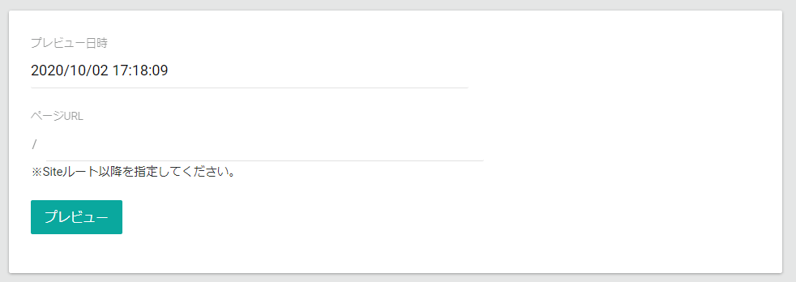

# プレビュー

プレビュー機能は*モバイル対応*していないため殆ど利用されておりません。  
昨今ではページプレビューには、対象となるページをカスタマイズし、柔軟にプレビュー可能な実装にすることを推奨しております。

プレビュー機能は、指定した日時にページがどのように表示されるかを検証できる機能です。  
例えば、未来に公開する特集ページをその公開タイミングではどのように表示されるかなどを確認するために使用します。  
プレビューで確認が可能なページは、ECサイトの共通機能（カート、購入フロー）以外の商品詳細ページ、トップページが対象となります。  
プレビュー機能を利用する場合は、事前にプレビュー対象とするページ側でプレビューが機能するように調整が必要になります。

- **プレビュー日時**: プレビューしたい日時を指定します。  
- **ページURL**: プレビューしたいURLを指定します。

以下はプレビュー日時に, `2021/01/01 00:00:00`を指定してプレビューした場合の例です。

