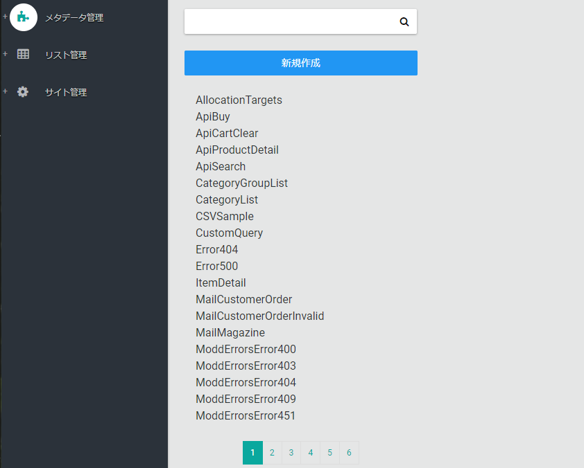
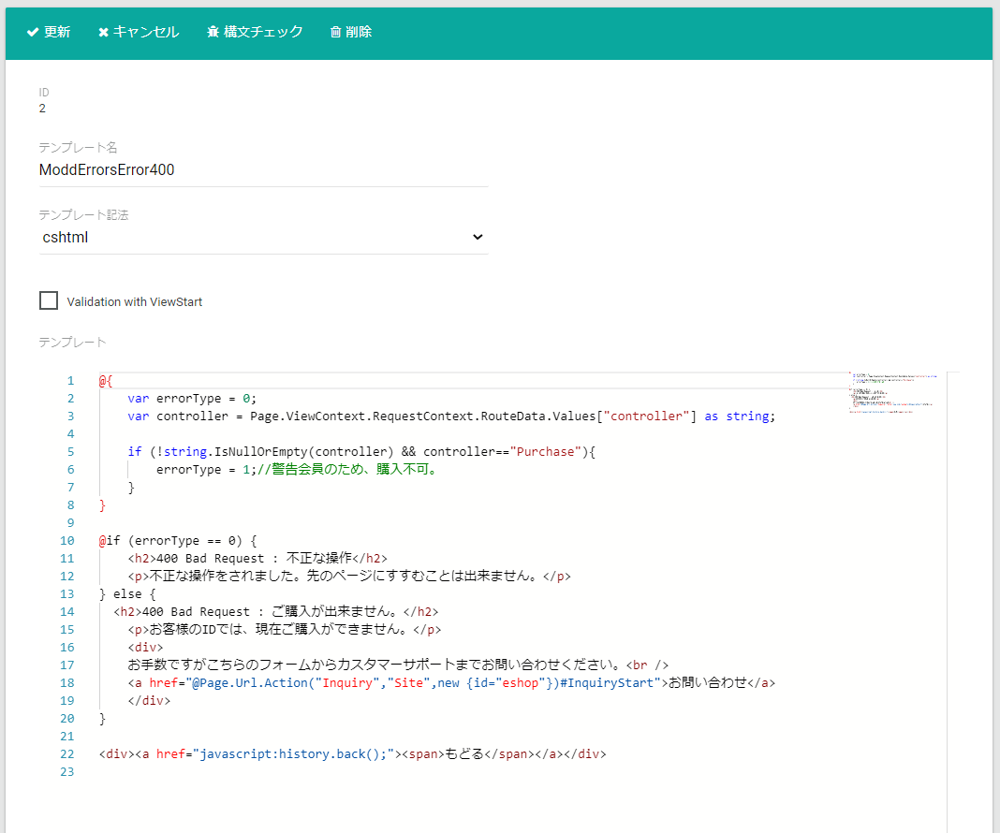

# テンプレート
テンプレート管理ページでは、テンプレートの追加・更新・削除、テンプレートの構文チェックを行います。  
このページで管理するテンプレートは

- cshtmlテンプレート: 商品ページなどECサイトで表示されるページ用テンプレート
- mailテンプレート: 受注確認メールなどメールで利用されるテンプレート
- csxテンプレート: バックエンド業務で利用するデータの取得に利用されるテンプレート

になります。

## テンプレート言語・記法
上記で記述したテンプレートは、全て C# というプログラミング言語を利用します。  
利用言語は、C# ですがそれぞれ用途に合わせた記法で記述します。  
テンプレートの詳細は、[開発:テンプレート](../../../../development/template) よりご参照ください。

|  テンプレート記法  |       構文        |                        特徴                         |
| ------------------ | ----------------- | --------------------------------------------------- |
| cshtmlテンプレート | Razor     | Razor専用構文、C#、HTMLで構成されます。             |
| mailテンプレート | Razor             | Razor専用構文、C#、メール用テキストで構成されます。 |
| csxテンプレート    | CSX(C#スクリプト) | C#プログラムをほぼそのまま記述すします。            |

## テンプレート一覧
テンプレート管理ページを開くと、テンプレート一覧が表示されます。  
一覧よりテンプレートを選択することで、テンプレートの編集を行うことが出来ます。  
**新規作成**ボタンを押下することで新規にテンプレートを作成できます。

## テンプレート詳細
一覧で選択したテンプレートが表示されます。

### 更新
テンプレートを更新します。以下の項目を指定し**更新**ボタンを押下して変更を保存します。

- **テンプレート名**: テンプレートの名称を指定します。
- **テンプレート記法**: テンプレートの記法を指定します。以下より選択します。
  - template
  - cshtml
  - mail
  - csx
- **テンプレート**: テンプレート本文を指定します。

### 構文チェック
テンプレートの更新前などにテンプレートに誤りがないか構文チェックを行うことが出来ます。  
cshtmlテンプレートの構文チェックを行う場合、**validation with ViewStart**のチェックをいれて検証します。


csthmlテンプレートは、**複数のテンプレートを結合**して１つのWebページの出力を生成します。  
そのためcshtmlテンプレートの構文チェックを行う場合は、**validation with ViewStart**にチェックを入れてください。

例）商品ページを出力する場合、商品ページテンプレートにページ全体のレイアウトが記述されたレイアウトテンプレート、ヘッダー・フッター用の部分テンプレートが
結合されてページが生成されます。  


