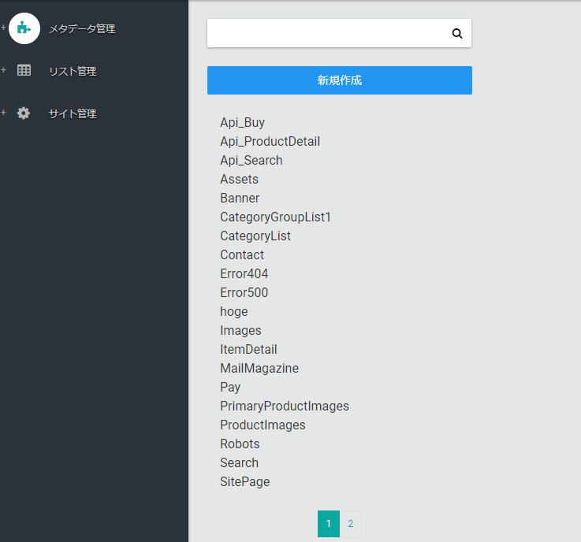
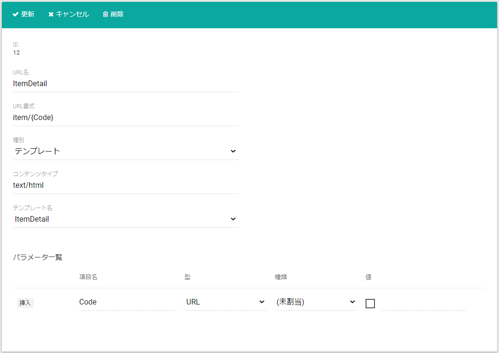
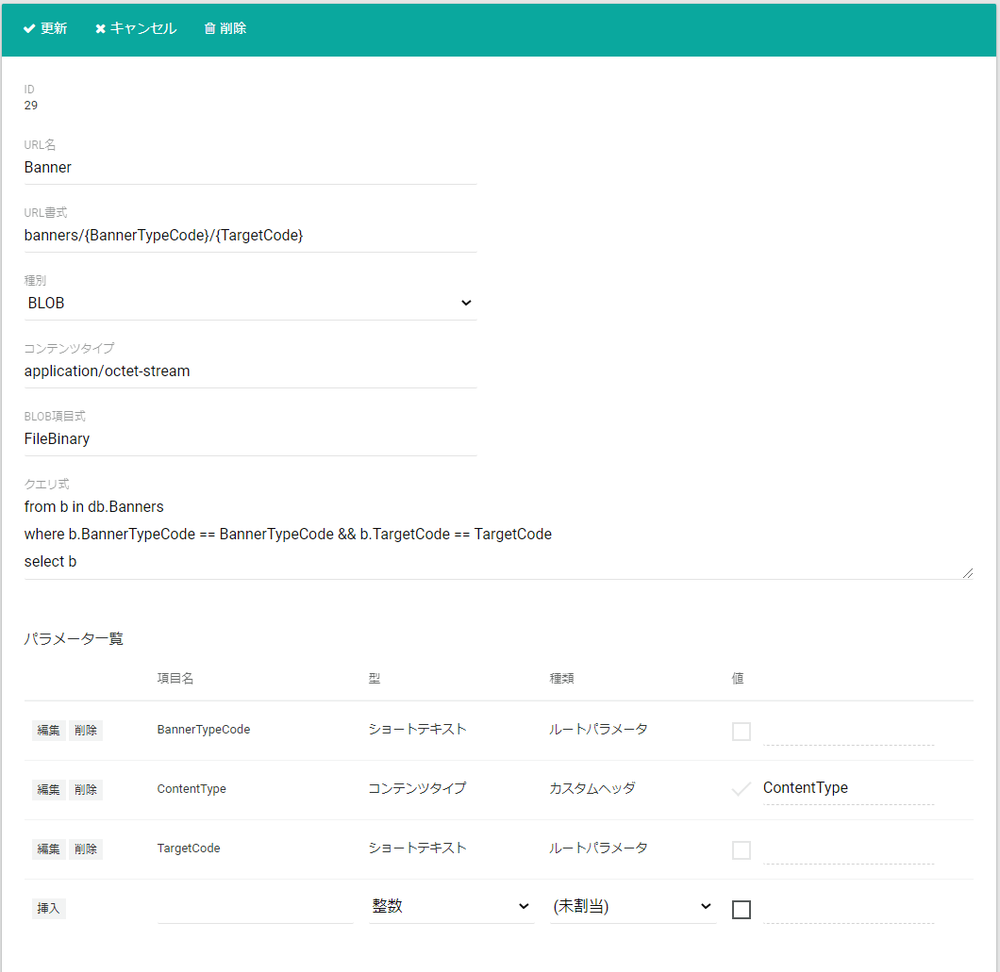

URL管理ページではECサイトのURL定義を行います。  
但し、カートなどEC共通機能のURLは事前に定義されてますので、商品特集ページや店舗情報ページなど
テナント固有ページのURLをここで定義します。

## URL一覧
URL管理ページを開くと、URL一覧が表示されます。  
一覧よりURL名を選択することで、URLの編集を行うことが出来ます。  
**新規作成**ボタンを押下することで新規にURLを作成できます。

## URL詳細
一覧で選択したURLが表示されます。

### テンプレート種別のURLを定義する
URLを定義する際、**種別**に**テンプレート**を指定することでテンプレートを使用してレスポンスを生成するURLを定義できます。
テンプレートは、[テンプレート管理ページ](../template)より登録できます。

以下の項目を指定します。
- **URL名**: URLを識別する名前を指定します。
- **URL書式**: URL、またはURLのパターンを指定します。以下にURL書式例を挙げます。

|       URL書式       |                                             URL                                              |                   説明                   |
| ------------------- | -------------------------------------------------------------------------------------------- | ---------------------------------------- |
| (未入力)            | `https://www.example.com/`  `https://www.example.com/?Nx=1`                                   | ルートページで使用                       |
| landing             | `https://www.example.com/landing`  `https://www.example.com/landing?x=1`                     | 単一の固定URLのページで使用              |
| items/{Code}        | `https://www.example.com/items/blue_jacket`  `https://www.example.com/items/cool_shirt`      | 商品詳細ページなどで使用                 |
| shops/{Pref}/{Name} | `https://www.example.com/shops/tokyo/ningyocho`  `https://www.example.com/kanagawa/shonan`   | 階層構造が固定のファイル構造の場合に使用 |
| images/{Path*}      | `https://www.example.com/images/hero.png`  `https://www.example.com/images/special/hero.png` | 階層構造が可変のファイル構造の場合に使用 |

URL書式の中でプレースホルダー `{xxx}`, `{xxx*}` を定義することが出来ます。  
プレースホルダー `{xxx}` の場合は、 xxxがプレースホルダーの名前になります。  
URLがプレースホルダーに受付ける値は項目**パラメータ一覧**で制御できます。

- **種別**: テンプレート
- **コンテンツタイプ**: レスポンスのコンテンツタイプを指定します。 例）`text/html`, `application/json`
- **テンプレート名**: テンプレートを指定します。
- **パラメータ一覧**: URLを制御するパラメーターを指定します。

### Blob種別のURLを定義する
URLを定義する際、**種別**に**BLOB**を指定することでBlob(Binary large object)、つまりバイナリデータをレスポンスとして返却するURLを定義できます。

以下の項目を指定します。
- **URL名**: URLを識別する名前を指定します。
- **URL書式**: URL、またはURLのパターンを指定します。上記のURL書式例をご参照ください。
- **コンテンツタイプ**: レスポンスのコンテンツタイプを指定します。 例）`text/html`, `application/json`
- **BLOB項目式**: Blobが格納されたフィールドを指定します。
- **クエリ式**: Blobが格納されたCMSデータテーブルを抽出します。C#のLinq式で記述します。抽出条件に、URLプレースホルダーに指定された値を使用することが出来ます。
- **パラメータ一覧**: URLを制御するパラメーターを指定します。