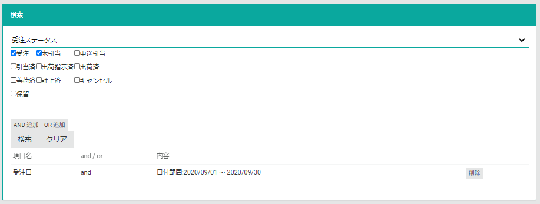
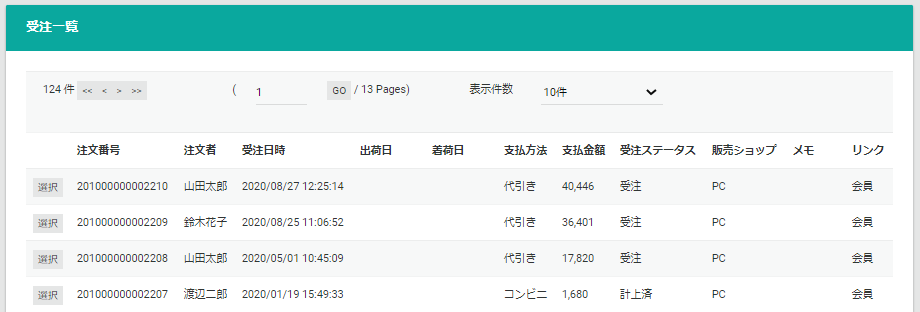

# EC管理サイト

## EC管理ページ一覧
- [トップ](top)
- 受注管理
  - [受注](order)
  - [仮予約](reserve-order)
- 商品管理
  - [商品](product)
  - [カテゴリ](category)
  - [販売パターン](sales-pattern)
  - [お気に入り](favorite)
- 会員管理
  - [会員](customer)
- 販促管理
  - [キャンペーン](campaign)
- 在庫管理
  - [在庫](stock)

## 一括アップロード
EC管理サイトでの一括アップロードの共通仕様を説明します。  
EC管理サイトでは、一部のデータを**TSV(Tab-separated values)ファイル**をアップロードすることで一括で登録・更新を行うことができます。  

### TSVファイル仕様

- ファイルエンコーディング: **Shift-JIS**
- 区切り文字: **タブ**
- 改行を含むデータの登録は不可
- [オーダーカスタム](../../../features/system-scope)でカラム名の変更が可能
- 必須ではないカラムはTSVファイルから省略することが出来ます

実際にアップロードするTSVファイル仕様は、各ページの説明をご参照ください。

### 一括アップロード手順

1. 一括アップロードで行うデータ登録（商品追加など）を選択します。
2. TSVファイルをアップロードします。
3. アップロードしたTSVファイルのチェックが行われます。問題があればエラーが表示されます。問題なければ**実行**ボタンが表示されます。
4. **実行**ボタンを押下するとデータ登録処理が行われます。

## 検索
EC管理サイトの各ページはデータの検索機能があります。全ての検索機能を有するページでの検索手順は共通です。

1. 絞り込む項目を指定する
2. 絞り込み条件を指定する
3. **AND 追加**, **OR 追加** ボタンより指定条件を既存条件にどのように連結するか指定します
4. **検索** ボタンを押下する

以下は受注ページで既に**受注日**の検索条件が設定されている場合に**受注ステータス**の検索条件を追加する例です。

検索結果で、表示するページ番号・１ページに表示する件数を調整することができます。
検索結果のアイテムの一番左にある**選択**ボタンを押下するとアイテムの詳細が表示されます。
以下は受注の検索結果例です。

