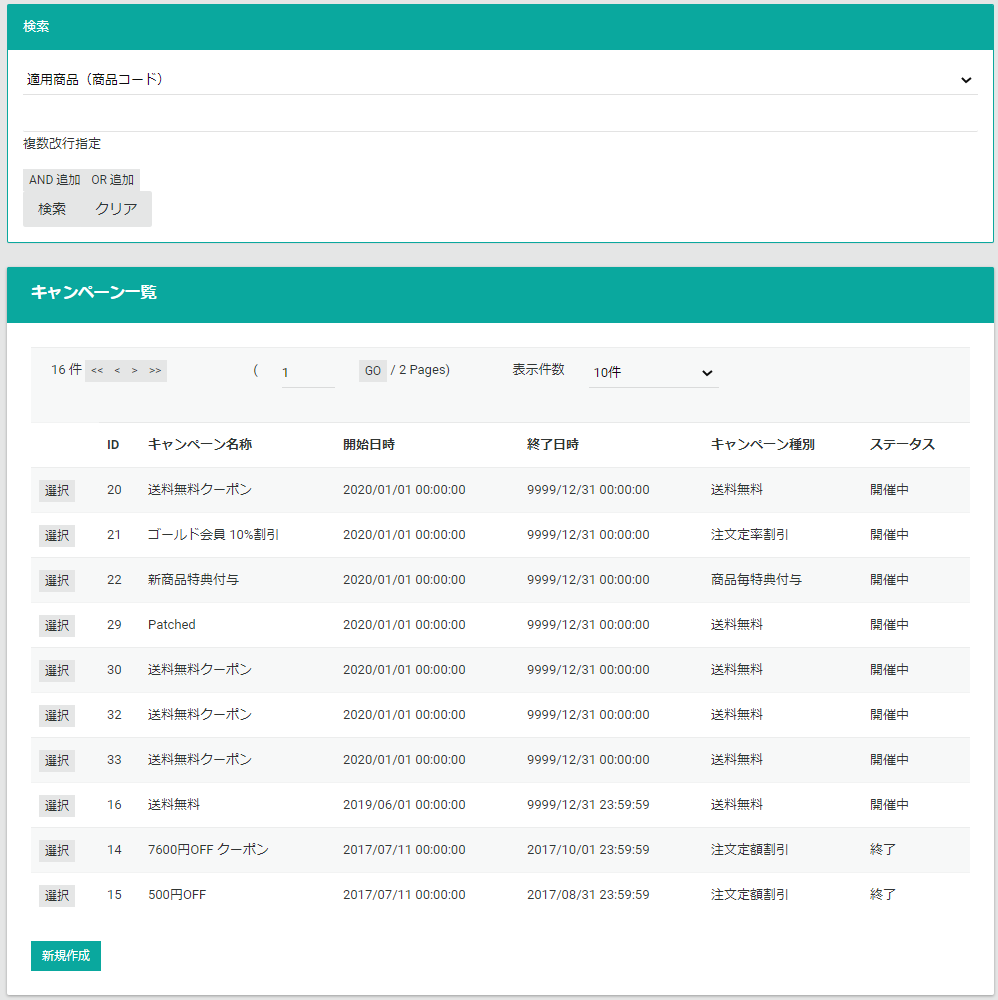
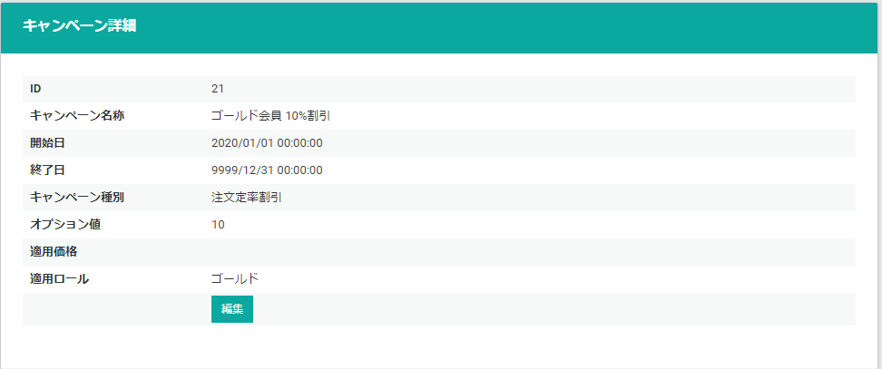
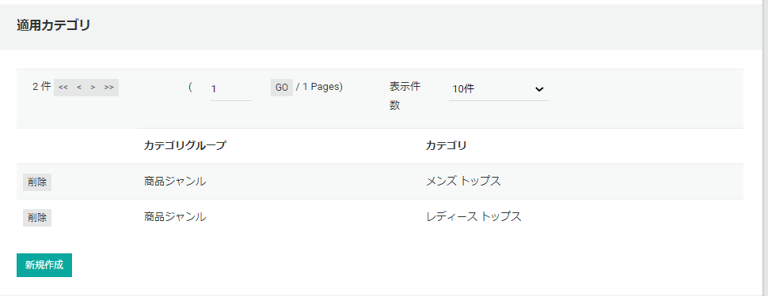
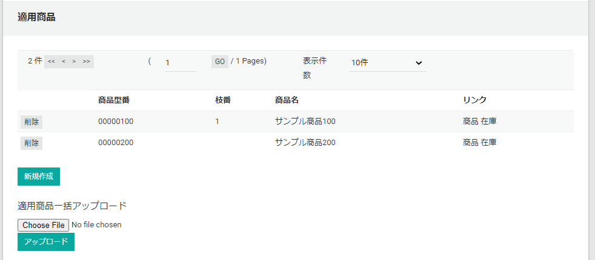
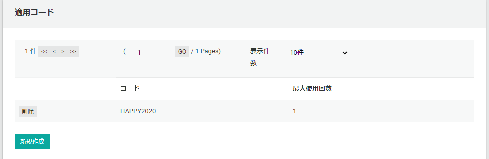
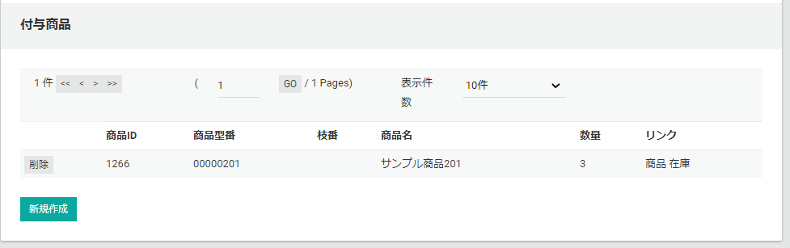
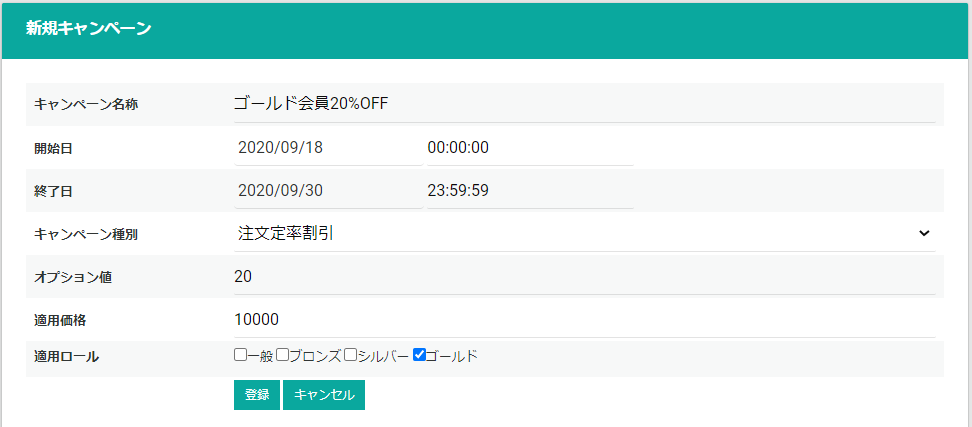

販売キャンペーンの管理と登録を行います。  
購入時にキャンペーンが適用される条件は、指定した**全ての適用条件を満たした**場合に限ります。  
キャンペーンを複数登録し、１受注で複数のキャンペーン条件を満たした場合、それぞれのキャンペーンが適用されます。
（但し標準では値引きキャンペーンに関しては、最も値引き率の高いキャンペーンが適用されます。）

## キャンペーン検索
検索条件を指定してキャンペーンを一覧表示します。

## キャンペーン情報
キャンペーン一覧より選択したときにキャンペーン情報を表示します。

### キャンペーン基本情報
キャンペーンの基本情報を表示します。  
**編集**ボタンより、情報を変更することが出来ます。  
[キャンペーンの登録](.#キャンペーンの登録)は後述します。

### 適用カテゴリ
{}
適用カテゴリ・適用商品いずれかの指定がある場合は、適用カテゴリが設定された商品、
または適用商品に登録されている商品がキャンペーンの対象商品になります。
未登録の場合は、全ての商品が対象になります。
{}
適用対象のカテゴリを表示します。  
**新規作成**ボタンより、カテゴリを追加することが出来ます。  
**削除**ボタンより、カテゴリを追加することが出来ます。

### 適用商品
{}
適用カテゴリ・適用商品いずれかの指定がある場合は、適用カテゴリが設定された商品、
または適用商品に登録されている商品がキャンペーンの対象商品になります。
未登録の場合は、全ての商品が対象になります。
{}
適用対象の商品を表示します。  
**新規作成**ボタンより、商品を追加することが出来ます。  
**削除**ボタンより、商品を追加することが出来ます。  
[適用商品一括アップロード](.#適用商品一括アップロード)は後述します。

### 適用コード
{}
適用コードが登録されている場合、購入フローで登録されたコードを入力した時にキャンペーンが適用されます。
未登録の場合、コードの入力をしなくてもキャンペーンは適用されます。  
最大使用回数の指定がある場合は、その回数まで購入でコードを使用できます。  
*最大使用回数の指定がある場合は、ゲストはコードを入力してもキャンペーンは適用されません。（ゲストの購入は使用回数を数えられないため）*
{}
適用コード（クーポンコード）を表示します。  
**新規作成**ボタンより、コードを追加することが出来ます。  
**削除**ボタンより、コードを追加することが出来ます。  

### 付与商品
キャンペーンが適用されたときに付与される商品を表示します。  
**新規作成**ボタンより、コードを追加することが出来ます。  
**削除**ボタンより、コードを追加することが出来ます。  

## キャンペーンの登録
まず始めにキャンペーンの基本情報を登録します。  
基本情報の登録後に、適用カテゴリ、適用商品、適用コード、付与商品は登録できます。  
もし適用コードのみで適用されるようなクーポンの作成を想定している場合、
*始めて基本情報を登録する時に開始日を遠い未来に設定して作成中に条件が満たされないように注意してください。*

登録時は以下の情報を設定します。
- **キャンペーン名称**： キャンペーンの名称を入力します。
- **開始日**: キャンペーン適用開始日時を入力します。
- **終了日**: キャンペーン適用終了日時を入力します。
- **キャンペーン種別**: [キャンペーン種別](../../../../development/campaign#標準キャンペーンモジュール)を選びます。
- **オプション値**: キャンペーンのオプション値を設定します。値引キャンペーンの場合に、値引額か値引率を指定します。他のキャンペーンでは通常設定しません。
- **適用価格**: 適用対象となる購入時の最低商品合計金額を入力します。
- **適用ロール**: 適用対象となる会員ロールを選択します。指定したロールを持つ会員のみキャンペーンが適用されます。

## 適用商品一括アップロード
一括で適用商品を追加します。[適用商品TSVファイル](.#適用商品tsvファイル)をアップロードします。

### 適用商品TSVファイル

|      カラム名      |  必須   |       フォーマット       |                                                     説明                                                     |
| :----------------- | :-----: | :----------------------- | :----------------------------------------------------------------------------------------------------------- |
| ProductId          | &Delta; | 数値                     | 内部商品ID、付与した場合はこの値が優先される                                                                 |
| ExternalId1        | &Delta; | `^[^\x00-\x1f]{1,32}$`   | 商品型番・商品コード、ExternalId2とセットで商品を決定する ProductIdが指定されている場合はそちらを優先する |
| ExternalId2        | &Delta; | `^[^\x00-\x1f]{1,32}$`   | 商品枝番、ExternalId1とセットで商品を決定する。ProductIdが指定されている場合はそちらを優先する             |
| ExternalId3        |         | `^[^\x00-\x1f]{1,32}$`   | 品目コード                                                                                                   |
| ExternalId4        |         | `^[^\x00-\x1f]{1,32}$`   | JANコード                                                                                                    |
| ProductName        |         | `^[^\x00-\x1f]+{1,128}$` | 商品名                                                                                                       |

