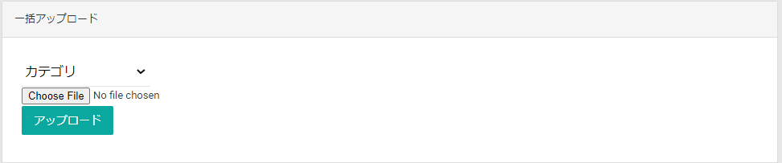

カテゴリページでは、商品に設定するカテゴリの登録・検索・編集処理を行います。

## カテゴリ検索
検索条件を指定してカテゴリを一覧表示します。

## カテゴリ情報
カテゴリ一覧で選択したカテゴリ情報を表示します。  
**編集**ボタンより、カテゴリの変更が可能です。  
**削除**ボタンより、カテゴリの削除が可能です。

## カテゴリの登録
**新規登録**ボタンより、カテゴリの登録が可能です。

## 一括アップロード
TSVファイルをアップロードして一括でデータを登録します。

一括アップロードで登録できることは以下になります。

### カテゴリ
一括でカテゴリを追加します。[カテゴリTSVファイル](.#カテゴリtsvファイル)をアップロードします。

### カテゴリTSVファイル

|     カラム名      | 必須  |   フォーマット    |                               説明                                |
| :---------------- | :---: | :---------------- | :---------------------------------------------------------------- |
| CategoryGroupName |   O   | `^[^\x00-\x1f]+$` | カテゴリグループの名称                                            |
| CategoryName      |   O   | `^[^\x00-\x1f]+$` | カテゴリの名称                                                    |
| CategoryGroupId   |       | 数値              | カテゴリグループのID、設定した場合CategoryGroupNameより優先される |

