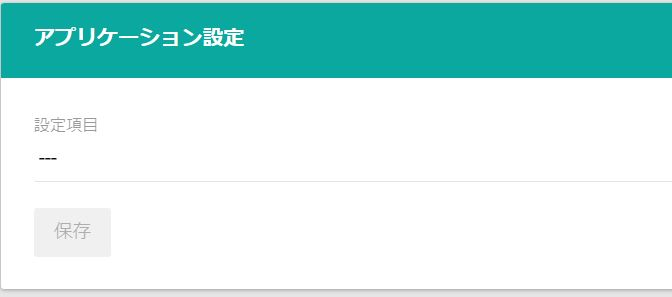
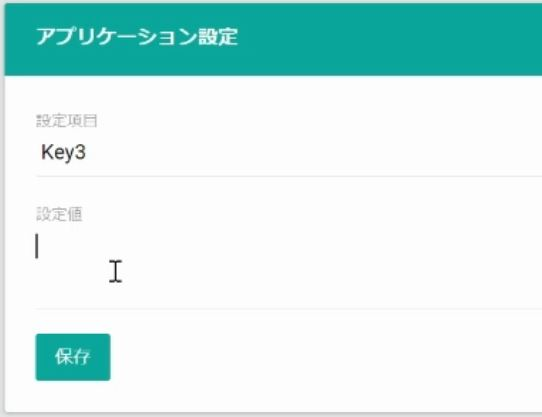

アプリケーション設定では、アプリケーション機能の関する設定を閲覧・変更します。

## 設定項目の選択

設定可能な項目は、「設定項目」ドロップダウンに表示されます。

設定値を変更するには、ドロップダウンから設定項目を設定し、設定値を入力して「保存」します。

※ 設定項目によって表示される入力フォームが異なります。

設定変更後、フロントに設定値を反映させるには、CMS管理画面から[再起動](../../cms/restart/)が必要です。

## CAPTCHA

「設定項目」から「CAPTCHA」を選択することで、CAPTCHAを構成できます。

※ 事前にテンプレートの[実装](../../../../development/captcha)が必要です。

CAPTCHAの各設定項目を次に示します。

|       項目       |       CAPTCHA       |                                                説明                                                 |
| :--------------- | :-----------------: | :-------------------------------------------------------------------------------------------------- |
| CAPTCHAサービス  |          *          | 使用するCAPTCHAサービスを選択します。reCAPTCHA Essentialsの構成にはreCAPTCHA Standardを使用します。 |
| 検証個所         |          *          | CAPTCHAチェックを行うエンドポイントを選択します。※対応は次表に示します。                            |
| 閾値             |          *          | リクエストを拒否する閾値を設定します。0に近いほどボットも含めて購入できるようになります。           |
| 無効化           |          *          | CAPTCHAチェックを無効化します                                                                       |
| サイトキー       | Standard/Enterprise | reCAPTCHAのサイトキーを設定します。                                                                 |
| シークレットキー |      Standard       | reCAPTCHAのシークレットキーを設定します。                                                           |
| プロジェクトID   |     Enterprise      | Google CloudのProject IDを設定します。                                                              |
| APIキー          |     Enterprise      | Google CloudのAPI Keyを設定します。                                                                 |

現在、使用可能なCAPTCHAサービスはGoogle reCAPTCHA V3 Essentials/Standard/Enterpriseとなります。[Cloudflare Turnstile](https://www.cloudflare.com/ja-jp/products/turnstile/) 等、Google reCAPTCHAとは異なるCAPTCHAサービスをご希望される場合はお問い合わせください。

`検証個所`には検証対象のエンドポイントを複数設定できます。例として、`Purchase/Create`と`Site/Login`を設定している場合は、注文確認画面の注文ボタンと、内部会員ログイン画面のログインボタンでCAPTCHAによる検証を実施できます。

|         Target         |        エンドポイント(`操作種別`)        |                   説明                   |
| :--------------------- | :------------------------------------- | :--------------------------------------- |
| Purchase/Create        | Purchase/{cart-id}                | 確認画面での購入ボタン押下時             |
| Purchase/Payment       | Purchase/{cart-id}/Payment        | 決済入力ページから確認画面への遷移時     |
| Site/Login             | Site/Login                        | 内部ログイン画面でのログインボタン押下時 |
| Site/Account/Confirm   | Site/Account (`confirm`)          | 内部会員登録ページから確認画面への遷移時 |
| Site/Account/Create    | Site/Account (`create`)           | 内部会員登録確認画面での登録ボタン押下時 |
| Site/Activate/Request  | Site/Activate (`request`)         | アクティベーションURL再送ボタン押下時    |
| Site/Recovery/Request  | Site/Recovery (`request`)         | パスワード再設定URL送信ボタン押下時      |
| Site/Inquiry/Confirm   | Site/Inquiry/{model} (`confirm`)  | お問い合わせページから確認画面への遷移時 |
| Site/Inquiry/Create    | Site/Inquiry/{model} (`create`)   | お問い合わせ確認画面での送信ボタン押下時 |
| Member/Payments/Create | Member/Payments/{type} (`create`) | 決済方法管理画面での登録ボタン押下時     |
| Member/Payments/Delete | Member/Payments/{type} (`delete`) | 決済方法管理画面での削除ボタン押下時     |

