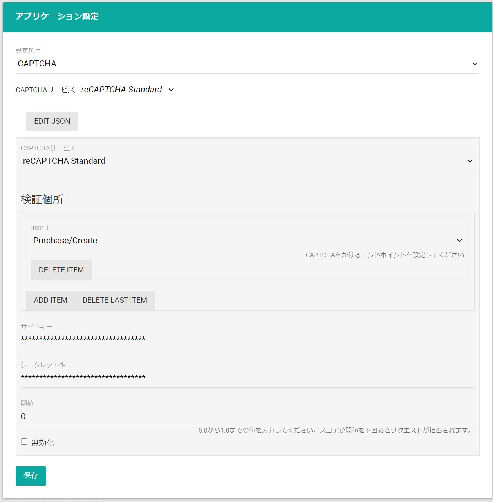

アプリケーション設定では、アプリケーション機能の関する設定を閲覧・変更します。

この操作には[BO.Administrators](../../#ec管理サイトのロール)権限が必要になります。

## 設定項目の選択

設定可能な項目は、「設定項目」ドロップダウンに表示されます。

設定値を変更するには、ドロップダウンから設定項目を設定し、設定値を入力して「保存」します。

<!-- textlint-disable ja-technical-writing/ja-no-mixed-period-->
{}
設定保存後、フロントに変更を反映させるには、CMS管理画面から[再起動](../../cms/restart/)が必要です。
{}
<!-- textlint-enable ja-technical-writing/ja-no-mixed-period-->

※ 設定項目によって表示される入力フォームが異なります。

## CAPTCHA

「設定項目」から「CAPTCHA」を選択することで、CAPTCHAを構成できます。

※ 事前にテンプレートの[実装](../../../../development/captcha)が必要です。

CAPTCHAの各設定項目を次に示します。

|       項目       |       CAPTCHA       |                                                説明                                                 |
| :--------------- | :-----------------: | :-------------------------------------------------------------------------------------------------- |
| CAPTCHAサービス  |          *          | 使用するCAPTCHAサービスを選択します。reCAPTCHA Essentialsの構成にはreCAPTCHA Standardを使用します。 |
| 検証個所         |          *          | CAPTCHAチェックを行うエンドポイントを選択します。※対応は次表に示します。                           |
| 閾値             |          *          | リクエストを拒否する閾値を設定します。スコアが閾値を下回るとリクエストが拒否されます。              |
| 無効化           |          *          | CAPTCHAチェックを無効化します                                                                       |
| サイトキー       | Standard/Enterprise | reCAPTCHAのサイトキーを設定します。                                                                 |
| シークレットキー |      Standard       | reCAPTCHAのシークレットキーを設定します。                                                           |
| プロジェクトID   |     Enterprise      | Google CloudのProject IDを設定します。                                                              |
| APIキー          |     Enterprise      | Google CloudのAPI Keyを設定します。                                                                 |

現在、使用可能なCAPTCHAサービスはGoogle reCAPTCHA V3 Essentials/Standard/Enterpriseとなります。[Cloudflare Turnstile](https://www.cloudflare.com/ja-jp/products/turnstile/) 等、Google reCAPTCHAとは異なるCAPTCHAサービスをご希望される場合はお問い合わせください。

**検証個所**は検証対象のエンドポイントを複数設定できます。例として、`Purchase/Create`と`Site/Login`を設定している場合は、注文確認画面の注文ボタンと、内部会員ログイン画面のログインボタンでCAPTCHAによる検証を実施できます。

|     検証個所コード     |       エンドポイント(`操作種別`)       |                   説明                   |
| :--------------------- | :------------------------------------- | :--------------------------------------- |
| Purchase/Create        | POST Purchase/{cart-id}                | 確認画面での購入ボタン押下時             |
| Purchase/Payment       | POST Purchase/{cart-id}/Payment        | 決済入力ページから確認画面への遷移時     |
| Site/Login             | POST Site/Login                        | 内部ログイン画面でのログインボタン押下時 |
| Site/Account/Confirm   | POST Site/Account (`confirm`)          | 内部会員登録ページから確認画面への遷移時 |
| Site/Account/Create    | POST Site/Account (`create`)           | 内部会員登録確認画面での登録ボタン押下時 |
| Site/Activate/Request  | POST Site/Activate (`request`)         | アクティベーションURL再送ボタン押下時    |
| Site/Recovery/Request  | POST Site/Recovery (`request`)         | パスワード再設定URL送信ボタン押下時      |
| Site/Inquiry/Confirm   | POST Site/Inquiry/{model} (`confirm`)  | お問い合わせページから確認画面への遷移時 |
| Site/Inquiry/Create    | POST Site/Inquiry/{model} (`create`)   | お問い合わせ確認画面での送信ボタン押下時 |
| Member/Payments/Create | POST Member/Payments/{type} (`create`) | 決済方法管理画面での登録ボタン押下時     |
| Member/Payments/Delete | POST Member/Payments/{type} (`delete`) | 決済方法管理画面での削除ボタン押下時     |

### 閾値設定について

閾値は、0.0から1.0の間で設定できますが、適切な値はサイトの特性や利用状況に応じて変える必要があります。一般的に、値が低いほど多くのリクエストを許可し、値が高いほど厳しく判定します。

1. **初期設定の推奨**   
   初めてCAPTCHAサービスを導入する際は、すべてのリクエストを許可する「0.0」を設定し、統計データを蓄積することを推奨します。

3. **統計データの確認と調整**   
   CAPTCHAサービスが提供するダッシュボードで、数週間分のデータを確認し、サイトの利用状況に応じて適切な閾値に調整してください。例えば、スパムが多い場合は0.5以上に設定するなどの対策が有効です。

4. **学習期間の考慮**   
   CAPTCHAサービスにはユーザーの行動を学習する期間が必要です。そのため、導入初期はデータの蓄積を待ってから徐々に厳しくする調整が効果的です。
