会員情報を管理します。  
会員情報の検索、閲覧、ポイントの調整などを行います。

## 会員検索
検索条件を指定して会員を一覧表示します。

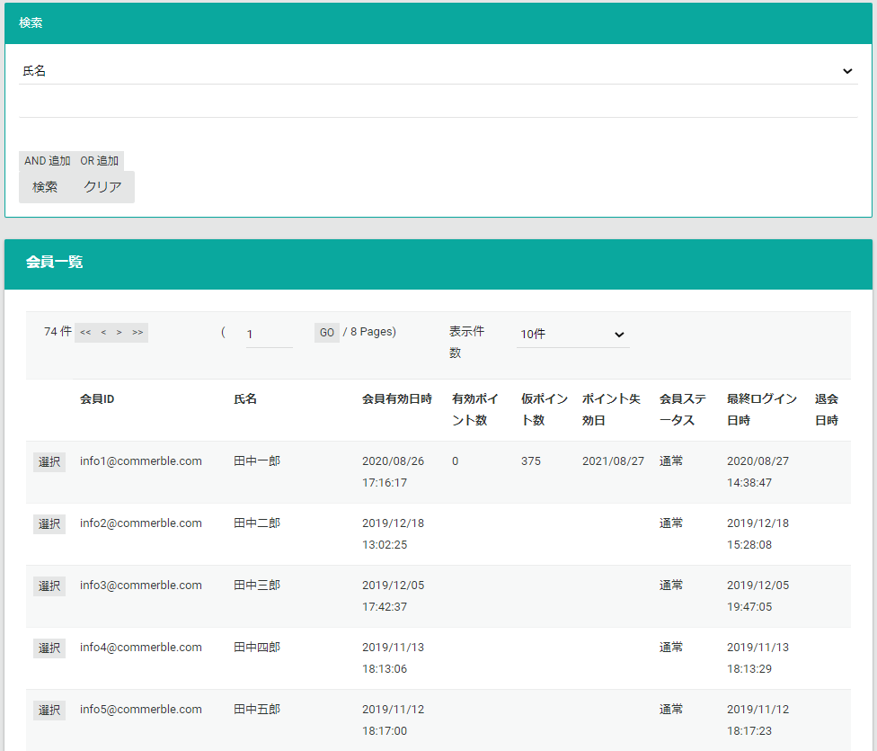

## 会員情報
{}
会員システムとして外部の会員システムを利用している場合、一部の情報のみが会員情報として閲覧できます。
{}
会員一覧で選択ボタンを押下すると会員の関連情報が表示されます。  
関連情報は以下の順番で表示されます。

### 会員情報
会員の情報を表示します。
**編集**ボタンより、情報の変更が可能です。  
**会員情報の編集**は後述します。

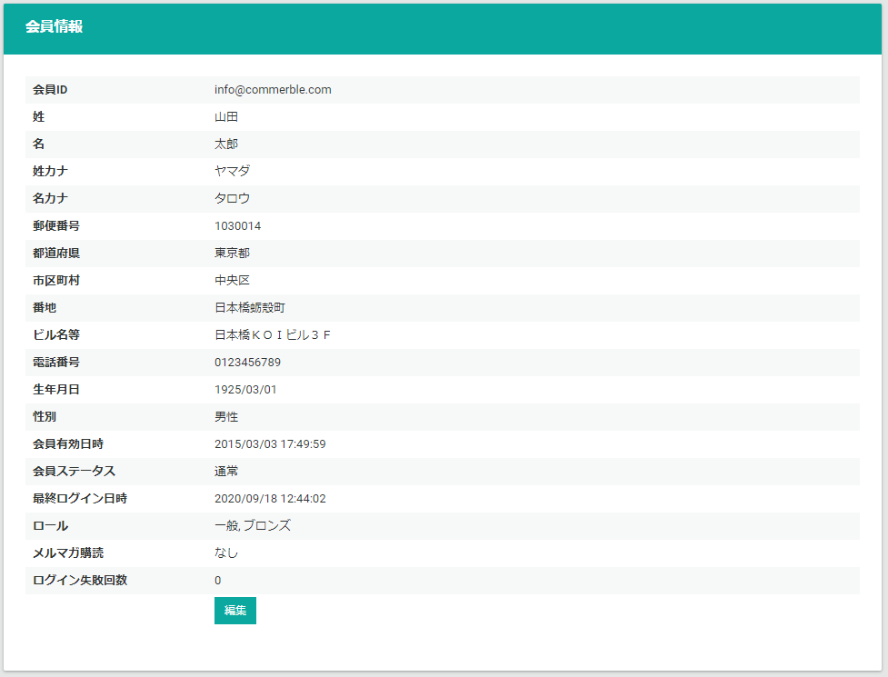

### 配送先
会員が登録している配送先を表示します。

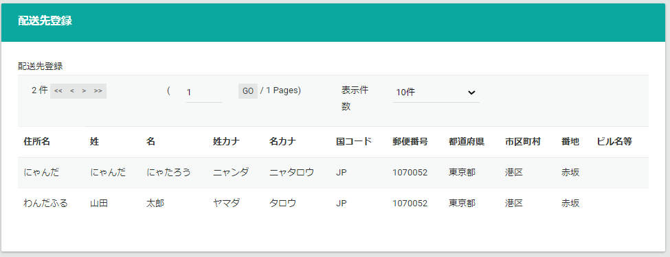

### 注文履歴
会員の注文履歴を表示します。

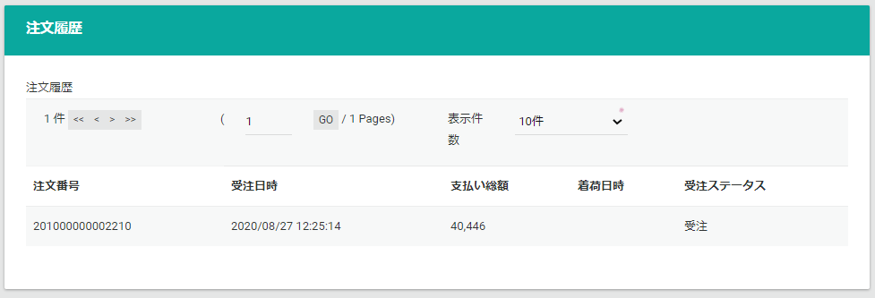

### お気に入り
会員のお気に入りを表示します。

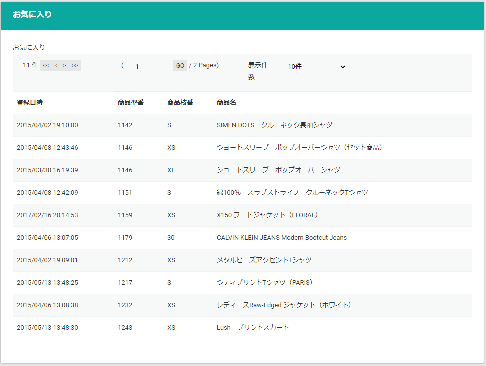

### 仮予約
会員の仮予約を表示します。

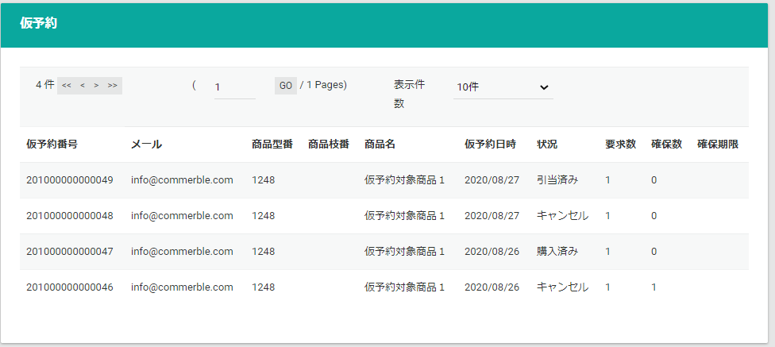

### ポイント情報
会員のポイント情報を表示します。  
[ポイントの調整](.#ポイントの調整)は後述します。

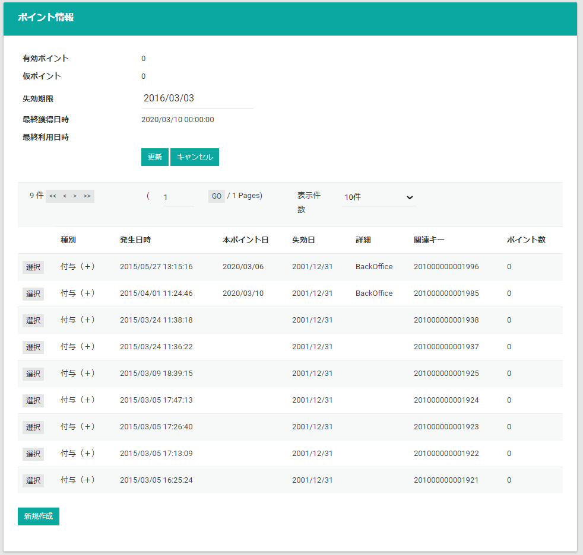

## 会員情報の編集
会員のステータスやロールを編集します。

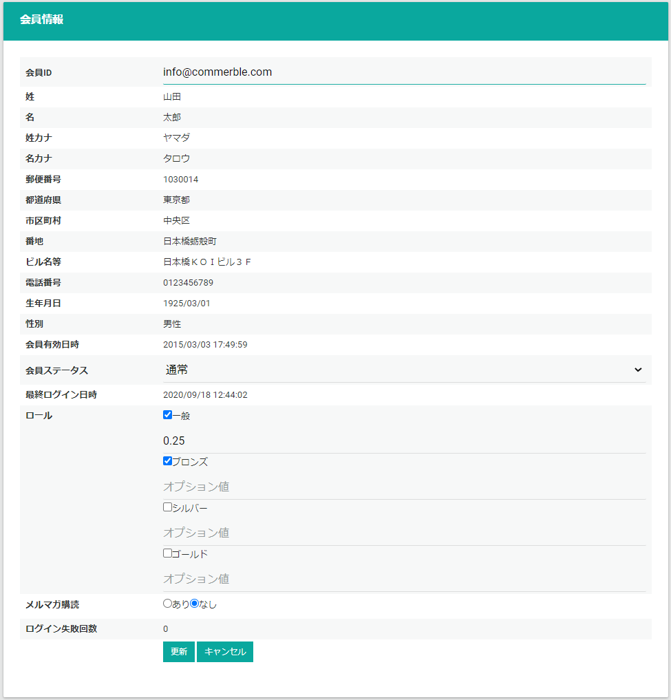

## ポイントの調整
{}
Commerble標準のポイント機能を利用している場合に使用します。
{}
会員のポイント情報の失効期限の変更、ポイントレコードを作成しポイント数の調整が可能です。

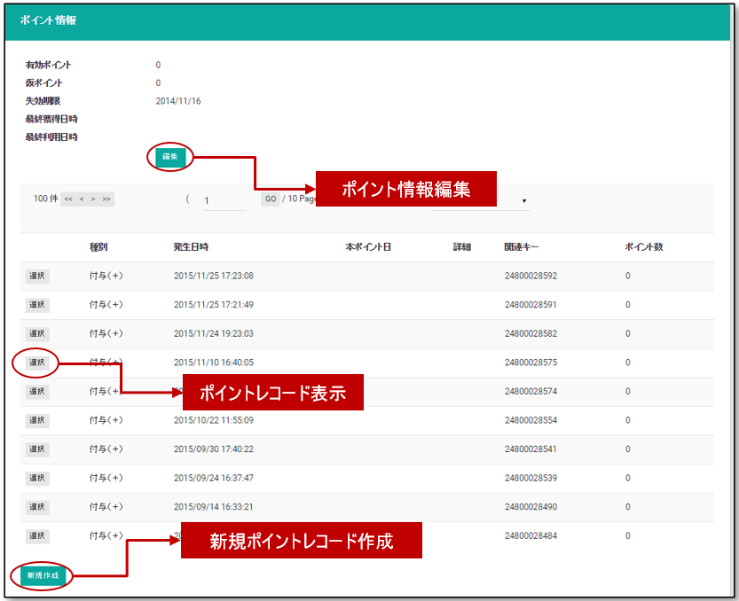

### ポイント情報編集
ポイントの失効期限を変更する事が出来ます。  
**キャンセル・返品等で、ポイントの有効期限を編集する必要がある場合に変更します。**

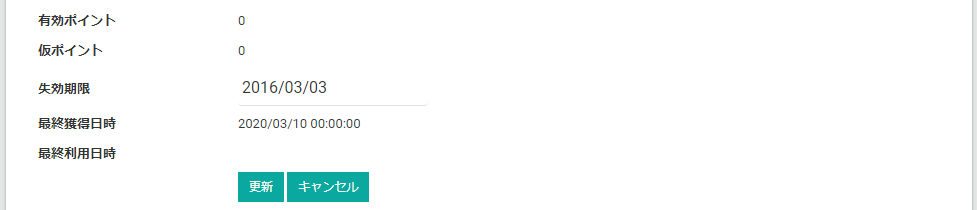

### ポイントレコード新規作成
新たなポイントレコードを作成し、ポイントの加算・減算等のポイント調整できます。

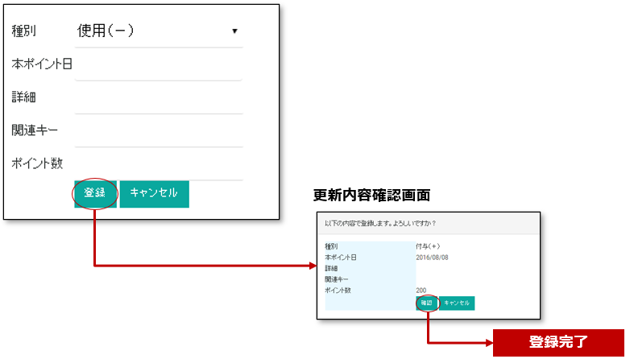

ポイントレコードの登録時には以下を指定します。

- **種別**: ポイント種別を選択します。
  - 使用（-）: ポイント使用レコードを作成します。
  - 使用キャンセル（+）: お客様が使用したポイントを戻します。
  - 付与（+）: ポイント付与レコードを作成します。
  - 付与キャンセル（-）: お客様に付与したポイントを剥奪します。
  - 調整（±）: 	(+) (-)で数値を入力し、調整レコードを作成します。*有効ポイントに即時反映されます*。
  - 失効（-）: ポイント失効レコードを作成します。
- **本ポイント日**: 本ポイントとして反映される日付けを選択します（調整の場合は入力不可）。
- **詳細**: ポイントレコードの詳細を入力します。
- **関連キー**: 関連キーの入力します。
- **ポイント数**: 調整するポイントの値を入力して下さい。

*ポイントレコードは削除出来ませんのでご注意下さい。*  
調整（±）の場合は、有効ポイントに即時反映されます。（本ポイント日を入力する必要はありません）

受注に紐づくポイントレコードの場合、関連キーが付与されています。  
その受注に対して調整する場合、同じ関連キーを入れ詳細にメモを記載しておく事をおすすめします。

### ポイントレコード編集
ポイントレコードの本ポイント日を入力し、仮ポイントを確定させる事が出来ます。

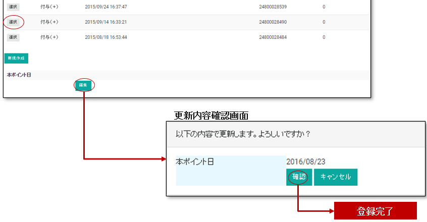

*※本ポイント日を入力日当日にした場合は即時反映されます。また、本ポイント日の取消は出来ません。*

