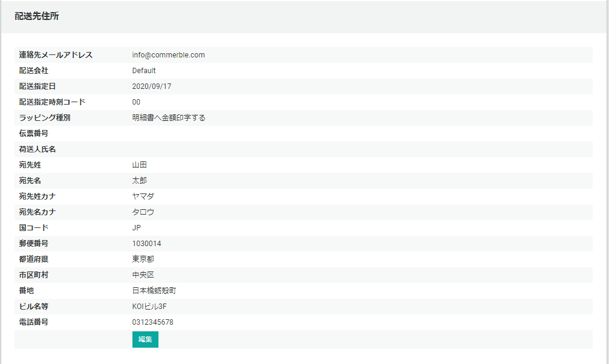
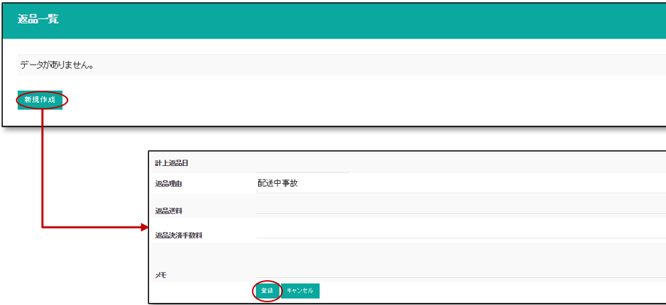

受注ページでは、受注情報の閲覧・編集・管理を行います。

## 受注検索
検索条件を指定して受注を一覧表示します。

## 受注情報
受注一覧で選択した受注情報を表示します。  
受注情報は複数のセクションで構成され以下の順番で表示されます。

### 受注基本情報
注文番号やステータス等、基本情報を表示します。  
**編集**ボタンより、情報の変更が可能です。  
**受注全キャンセル**ボタンは、出荷前の注文キャンセル時に使用します。（出荷前の時表示されます）   
**受注返品**ボタンは、着荷前の全キャンセル（返品）時に使用します。（出荷後の時表示されます）
**受注複製**ボタンは、注文データを複製する時に使用します。

[キャンセル](.#受注キャンセル)、[返品](.#受注返品)、[受注複製](.#受注複製)に関しては後述します。

### 注文者情報
注文者の情報を表示します。  
**編集**ボタンより情報の変更が可能です。

### 注文者住所
注文者住所を表示します。  
**編集**ボタンより情報の変更が可能です。

### 配送先情報
配送先の氏名や住所等、配送先の情報を表示します。  
**編集**ボタンより情報の変更が可能です。

### 決済基本情報
支払い金額や決済方法等、決済関連情報を表示します。  
**編集**ボタンより情報の変更が可能です。

### サービス情報
受注の自由項目情報をサービス情報といいます。サービス情報を一覧を表示します。  
**新規作成**ボタンより情報の追加が可能です。  
**選択**ボタンより情報の変更が可能です。  
**削除**ボタンより情報の削除が可能です。

### 受注明細一覧
受注明細の一覧を表示します。  
**新規作成**ボタンより情報の追加が可能です。  
**選択**ボタンより情報の参照・変更が可能です。以下は２番目の受注明細を選択した状態です。

**セット品の明細**  
セット品の商品は、親品番/子品番共に明細レコードに表示されます。  
子商品レコードにある価格は**按分価格**です。

### 返品一覧
返品情報と返品明細を表示します。  

### 適用キャンペーン
この受注に適用されたキャンペーン情報を表示します。

### メール送信履歴一覧
この受注に関するメールの送信履歴を表示します。  
**選択**ボタンより情報の参照が可能です。  

## 受注キャンセル
{}
受注キャンセルは**出荷前の受注**に対して行います。カスタマーからの電話・メールでのキャンセル依頼、
欠品等により出荷出来ない状況になった時に行います。
{}
{}
クレジット決済、コンビニ決済など受注キャンセル後に、決済サービスで処理が必要な場合があります。

- 受注キャンセル後に決済サービスの管理機能から手動で決済キャンセルを行う
- 受注キャンセルに連動して決済サービスのAPIを呼び出しキャンセルを行う機能の開発

など対応を想定してください。
{}

### 出荷前「全」キャンセル
受注基本情報内の**受注キャンセル**ボタンから受注の全キャンセルを行い、キャンセルされた商品の在庫数を指定場所に戻す事が可能です。

受注キャンセル時は以下のオプションが指定できます。

- **出荷可能数**: 在庫引当済み商品についての処理を選択します。
  - 加算しない
  - 通常加算する（出荷可能数へ加算）
  - 予備加算する（予備在庫へ加算）
- **販売可能数**: 販売可能数として戻すかどうか選択します。
  - 加算しない
  - 加算する

オプション設定が済んだら**受注キャンセル**ボタンよりキャンセル処理を実行します。

{}
セット品の場合、「子商品」は**出荷可能数**、「親商品」は**販売可能数**に在庫戻しが行われます。  
キャンペーン機能で付与される明細種別が「**特典**（明細印字なし）」の商品に対しては、在庫戻しは行われません。
{}

受注キャンセルを行うと、受注ステータスは**キャンセル**になり、キャンセル前のステータスが保存されます。

{}
Commerble標準のポイント機能を利用している場合、*お客様が利用されたポイントは自動返却し、着荷後付与予定となっている仮ポイントは減算されます。*  
- お客様使用ポイント → 本ポイントへ戻し
- 付与予定ポイント → 仮ポイントから減算

ポイントの有効期限を編集する場合は、会員のポイント情報を変更して下さい。 
{}

### 出荷前「部分」キャンセル
受注明細一覧からキャンセルとなった商品を**選択**し、詳細画面の**編集**ボタンを押下します。  
**明細種別**を**キャンセル**に更新します。

受注明細一覧に部分キャンセルが反映され、明細合計金額に反映されます。

{}
合計金額が変更された場合、[決済基本情報](.#決済基本情報) の金額も変更する必要があります。  
Commerble標準のポイント機能を利用している場合、受注に対するポイントの調整を**手動**で行う必要があります。会員のポイント情報を変更して下さい。
ポイントの有効期限を編集する場合も同様です。
{}

## 受注返品
{}
受注返品は**出荷後の受注**に対して行います。受け取り拒否や長期不在など商品がお客様に着荷せずに戻ってきた時や、商品に不良がありお客様から返送された時に返品処理を行います。
{}
{}
クレジット決済、コンビニ決済など受注返品後に、決済サービスで処理が必要な場合があります。

- 受注返品後に決済サービスの管理機能から手動で決済取消を行う
- 受注返品に連動して決済サービスのAPIを呼び出し取消処理を行う機能の開発

など対応を想定してください。
{}
### 着荷前「全」返品
受け取り拒否、長期不在等、着荷前受注の「全」返品処理を行います。  
受注基本情報内の**受注返品**ボタンから受注の全返品処理を行い、返品された商品の在庫数を指定場所に戻す事が可能です。

受注返品時は以下のオプションを指定できます。

- **出荷可能数**: 在庫引当済み商品についての処理を選択します。
  - 加算しない
  - 通常加算する（出荷可能数へ加算）
  - 予備加算する（予備在庫へ加算）
- **販売可能数**: 販売可能数として戻すかどうか選択します。
  - 加算しない
  - 加算する
- **返品理由**: 返品理由を選択し、データに残すことができます。

オプション設定が済んだら**受注返品**ボタンよりキャンセル処理を実行します。  
受注返品を行うと、[返品一覧](.#返品一覧)に返品レコードが追加され、返品明細が自動作成されます。  

{}
Commerble標準のポイント機能を利用している場合、*お客様が利用されたポイントは自動返却し、着荷後付与予定となっている仮ポイントは減算されます。*  
- お客様使用ポイント → 本ポイントへ戻し
- 付与予定ポイント → 仮ポイントから減算

ポイントの有効期限を編集する場合は、会員のポイント情報を変更して下さい。  
*着荷前の返品処理は、上記ポイント戻しが有効な場合にご利用下さい。*
{}

*この操作は着荷前の受注（受取拒否、不在返品等）に対してのみ行って下さい。*  
*着荷後返品された受注に対して「受注返品」は行わないで下さい。*  
*着荷後返品された受注の返品作業は、画面下の「返品情報の編集」より行って下さい。*

### 着荷後返品
着荷後の返品は、受注情報から返品情報データを手動で作成する必要があります。  
対象となる受注を検索し、受注情報を表示してください。

まずは受注明細下部にある[返品一覧](.#返品一覧) より返品情報を登録します。

**返品送料について**  
受取拒否や不良品など店舗側が送料を負担する場合、
送料の売上金もマイナス計上する必要がある為、かかった送料を入力します。  
お客様都合の返品の場合（送料お客様負担）で、
送料をお客様負担として頂く場合や元々送料無料注文だった場合は、
送料金額は返金対象とならないため、0と入力します。

返品情報を登録すると、返品一覧に返品情報レコードが追加されます。

次に返品となった商品の返品明細を作成します。  
受注明細の情報を参考にして入力して下さい。

複数返品商品がある場合は、同様の操作を複数回行って下さい。  
返品レコードを作成すると、返品明細一覧に返品明細レコードが作成されます。

{}
在庫数の調整は、[在庫](../stock)ページから編集作業を行って下さい。

受注に対するポイントの調整を**手動**で行う必要があります。会員のポイント情報を変更して下さい。
ポイントの有効期限を編集する場合も同様です。
{}

### 受注複製
受注基本情報内の**受注複製**ボタンから、受注の複製処理を行います。

{}
複製された注文は、新たな注文番号が振番され、受注ステータスは**保留**でコピーされます。
複製された注文の受注情報には、複製元の受注IDが保存されます。
{}

**適用キャンペーン**や**メール送信履歴一覧**は複製先にコピーされません。

## 一括アップロード
TSVファイルをアップロードして一括でデータを登録します。

一括アップロードで登録できることは以下になります。

### 受注＋受注明細
受注情報と受注明細情報を一緒に追加します。  
TSVファイル名は固定で、受注情報は**Order.txt**という名前の[受注TSVファイル](.#受注tsvファイル)受注明細情報を、受注明細情報は**OrderLine.txt**という名前の[受注明細TSVファイル](.#受注明細tsvファイル)を用意します。
２つのファイルはまとめZIP圧縮してアップロードします。

### 受注明細
受注明細情報を追加します。[受注明細TSVファイル](.#受注明細tsvファイル)をアップロードします。

### 受注TSVファイル

|          カラム名          | 必須  |                                    フォーマット                                     |                                            説明                                            |
| :------------------------- | :---: | :---------------------------------------------------------------------------------- | :----------------------------------------------------------------------------------------- |
| OriginalOrderId            |   O   | 数値                                                                                | 受注シーケンス番号、受注明細CSVでの明細のグルーピングに使用する                            |
| IsGuest                    |   O   | 真偽値                                                                              | ゲスト購入フラグ                                                                           |
| MemberRank                 |       | 数値                                                                                | 会員ランク [MemberStatus](../../../../development/data/enum#memberstatus)       |
| OrdererName                |   O   | [PersonName](../../../../development/validation#personname)              | 受注者                                                                                     |
| FirstName                  |   O   | [PersonName](../../../../development/validation#personname)              | 名                                                                                         |
| LastName                   |   O   | [PersonName](../../../../development/validation#personname)              | 姓                                                                                         |
| FirstNameKana              |   O   | [PersonNameKana](../../../../development/validation#personnamekana)      | メイ                                                                                       |
| LastNameKana               |   O   | [PersonNameKana](../../../../development/validation#personnamekana)      | セイ                                                                                       |
| EmailAddr                  |   O   |                                                                                     | 注文者メールアドレス                                                                       |
| Birthday                   |       | 日付                                                                                | 注文者誕生日                                                                               |
| Sex                        |   O   | 数値                                                                                | 性別 [HumanSexes](../../../../development/data/enum#humansexes)                 |
| UserNo                     |       | 数値                                                                                | ユーザ番号                                                                                 |
| UserName                   |       | 文字列                                                                              |                                                                                            |
| OrderType                  |   O   | 数値                                                                                | 受注タイプ [OrderType](../../../../development/data/enum#ordertype)             |
| OrderStatus                |   O   | 数値                                                                                | 受注ステータス [OrderStatus](../../../../development/data/enum#orderstatus)     |
| OrderDate                  |       | 日付時間                                                                            | 受注日時                                                                                   |
| AllocationCompleteDate     |       | 日付時間                                                                            | 引当完了日                                                                                 |
| ShipRequestDate            |       | 日付時間                                                                            | 出荷指示日                                                                                 |
| EstimateShipDate           |       | 日付時間                                                                            | 出荷予定日                                                                                 |
| ShipDate                   |       | 日付時間                                                                            | 出荷日                                                                                     |
| DeliveryCompleteDate       |       | 日付時間                                                                            | 着荷日                                                                                     |
| DeliveryReportDate         |       | 日付時間                                                                            | 報告着荷日                                                                                 |
| ReturnDate                 |       | 日付時間                                                                            | 返品日                                                                                     |
| ShipBookAt                 |       | 日付時間                                                                            | 出荷計上日                                                                                 |
| DeliveryBookAt             |       | 日付時間                                                                            | 着荷計上日                                                                                 |
| PaymentMethod              |       | 数値                                                                                | 決済方法 [PaymentMethod](../../../../development/data/enum#paymentmethod)       |
| PaymentStatus              |       | 数値                                                                                | 決済ステータス [PaymentStatus](../../../../development/data/enum#paymentstatus) |
| TaxRate                    |   O   | 数値                                                                                | 税率                                                                                       |
| DeliveryCharge             |   O   | 数値                                                                                | 配送料                                                                                     |
| PointPaymentForDelivCharge |   O   | 数値                                                                                | 使用ポイント（配送料分）                                                                   |
| TotalPayment               |   O   | 数値                                                                                | 支払総額                                                                                   |
| TotalUsagePoint            |   O   | 数値                                                                                | 使用ポイント                                                                               |
| ReturnPrice                |   O   | 数値                                                                                | 返金額                                                                                     |
| PaymentCharge              |   O   | 数値                                                                                | 手数料                                                                                     |
| ExtraPoint                 |   O   | 数値                                                                                | 特別ポイント（受注分）                                                                     |
| ExtraPointSummary          |   O   | 数値                                                                                | 特別ポイント計                                                                             |
| ChargePointSummary         |   O   | 数値                                                                                | 付与ポイント計                                                                             |
| DiscountPrice              |   O   | 数値                                                                                | 値引額                                                                                     |
| SiteId                     |   O   | 数値                                                                                | 販売ショップID                                                                             |
| HourRange                  |   O   | `{0-9}{4}`                                                                          | 配送希望時間帯 (8時から12時='0812'、14時から16時='1416')                                   |
| WrappingType               |   O   | `[1,2]`                                                                             | ラッピング種別（1:明細書へ金額印字しない, 2:明細書へ金額印字する）                         |
| SenderName                 |       | `.{20}`                                                                             | ラッピング種別（1:明細書へ金額印字しない, 2:明細書へ金額印字する）                         |
| DeliveryNo                 |       | `^\w{0,20}$`                                                                        | ラッピング種別（1:明細書へ金額印字しない, 2:明細書へ金額印字する）                         |
| DeliveryMailAddr           |   O   | メールアドレス                                                                      | 配送先メールアドレス                                                                       |
| RecipientFirstName         |   O   | [PersonName](../../../../development/validation#personname)              | 配送先 名                                                                                  |
| RecipientFirstNameKana     |   O   | [PersonNameKana](../../../../development/validation#personnamekana)      | 配送先 メイ                                                                                |
| RecipientLastName          |   O   | [PersonName](../../../../development/validation#personname)              | 配送先 姓                                                                                  |
| RecipientLastNameKana      |   O   | [PersonNameKana](../../../../development/validation#personnamekana)      | 配送先 セイ                                                                                |
| CountryCode                |   O   | `^[A-Za-z]{2}$`                                                                     | 配送先国 (例：JP)                                                                          |
| ZipCode                    |   O   | `^\d{7}$`                                                                           | 配送先郵便番号                                                                             |
| Pref                       |   O   | [AddressPart](../../../../development/validation#addresspart)  1-10文字  | 配送先都道府県                                                                             |
| City                       |   O   | [AddressPart](../../../../development/validation#addresspart)  1-128文字 | 配送先市区町村名                                                                           |
| Street                     |   O   | [AddressPart](../../../../development/validation#addresspart)  1-128文字 | 配送先番地                                                                                 |
| Building                   |       | [AddressPart](../../../../development/validation#addresspart)  1-128文字 | 配送先ビル名等                                                                             |
| Tel                        |       | `^[0-9]{0,11}$`                                                                     | 配送先電話番号                                                                             |
| ShipSourceId               |       | 数値                                                                                | 配送元ID                                                                                   |
| AuthorizeNo                |       | 文字列 最大128文字                                                                  | 承認番号                                                                                   |
| AuthorizeAt                |       | 日付時間                                                                            | 与信日時                                                                                   |
| TransactionNo              |       | 文字列 最大128文字                                                                  | 取引ID                                                                                     |
| PaymentDetail              |       | 文字列 最大128文字                                                                  | 決済種別                                                                                   |
| PaymentSlipNumber          |       | 文字列 最大128文字                                                                  | 受付番号                                                                                   |
| PaymentSlipUrl             |       | 文字列 最大128文字                                                                  | 払込票URL                                                                                  |
| CompletePayment            |   O   | 真偽値                                                                              | 決済完了                                                                                   |
| PaymentMailAddr            |       | メールアドレス                                                                      | 請求先メールアドレス                                                                       |

### 受注明細TSVファイル

|       カラム名       | 必須  |    フォーマット    |                             説明                             |
| :------------------- | :---: | :----------------- | :----------------------------------------------------------- |
| OriginalOrderId      |   O   | 数値               | 受注シーケンス番号、もしくは、受注番号                       |
| OrderLineType        |   O   | 数値               | 受注タイプ [OrderLineType](../../../../development/data/enum#orderlinetype) |
| ProductId            |   O   | 数値               | 内部商品ID                                                   |
| OrderAmount          |   O   | 数値               | 受注数                                                       |
| AllocateAmount       |   O   | 数値               | 引当数                                                       |
| UnitPrice            |   O   | 数値               | 単価(税抜)                                                   |
| UnitPrice            |   O   | 数値               | 計上額(税込)                                                 |
| UnitPrice            |   O   | 数値               | 小計(税込)                                                   |
| Tax                  |   O   | 数値               | 税額                                                         |
| PointUsage           |   O   | 数値               | 使用ポイント                                                 |
| PointUsageTax        |   O   | 数値               | 使用ポイント(税額分)                                         |
| PointUsagePrice      |   O   | 数値               | 使用ポイント(商品分)                                         |
| PointCharge          |   O   | 数値               | 付与ポイント                                                 |
| PointChargeRate      |   O   | 数値               | ポイント付与率                                               |
| ExtraPoint           |   O   | 数値               | 特別ポイント                                                 |
| DiscountPrice        |   O   | 数値               | 値引額                                                       |
| AllocateCompleteDate |       | 日付時間           | 引当完了日時                                                 |
| Description          |       | 文字列 最大256文字 | 補足                                                         |

