商品ページでは、商品の登録、検索、編集処理を行います。

## 商品検索
検索条件を指定して商品を一覧表示します。

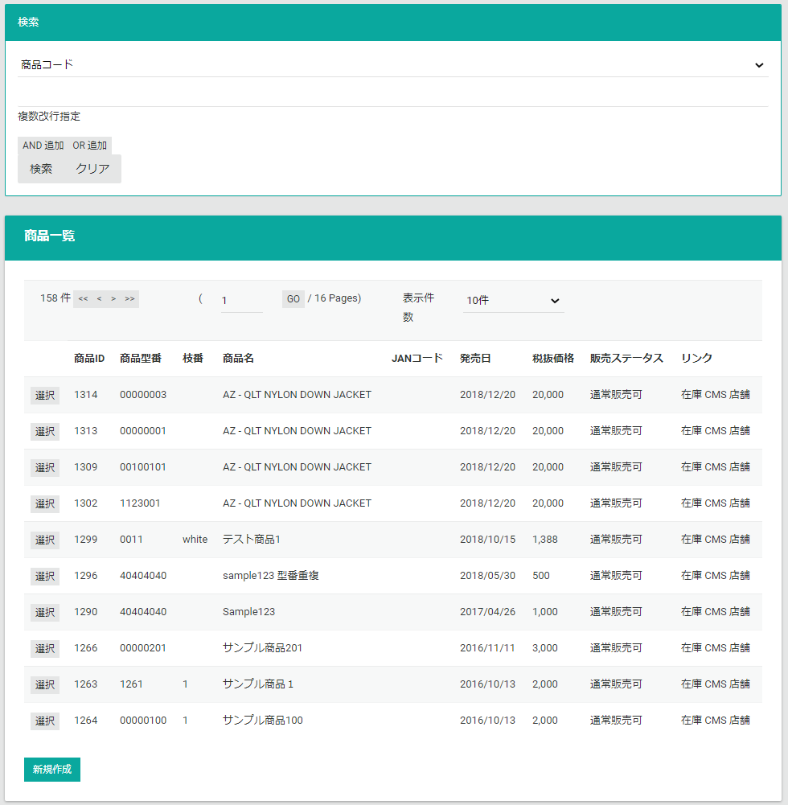

## 商品情報
商品一覧で選択した商品情報を表示します。  
受注情報は複数のセクションで構成され以下の順番で表示されます。

### 商品基本情報
商品の基本情報を表示します。  
**編集**ボタンより、情報の変更が可能です。

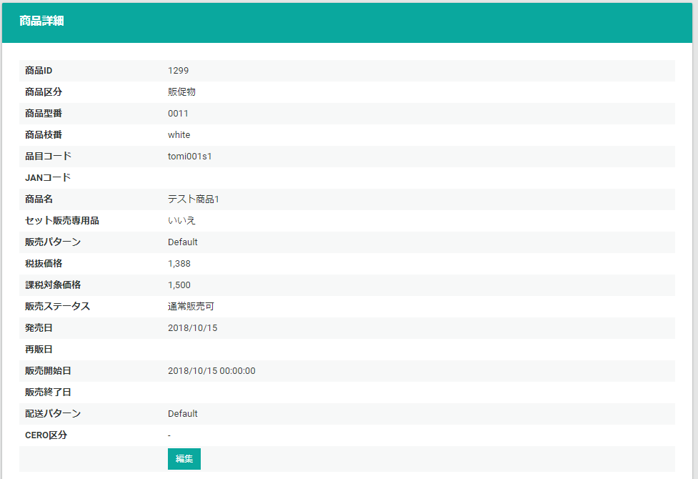

### 販売設定
商品個別に上書する販売ルールを表示します。  
通常商品の販売ルールは、[販売パターン](../sales-pattern)で定義し、[商品基本情報](.#商品基本情報)の**販売パターン**に設定します。  
商品個別で販売ルールを調整したいときに利用します。  
**編集**ボタンより、情報の変更が可能です。

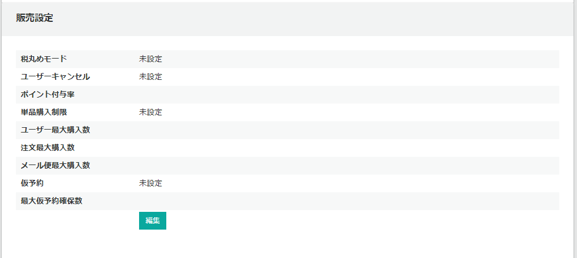

### セット商品
セット商品情報を表示します。  
[セット商品の登録](.#セット商品の登録)に関しては後述します。

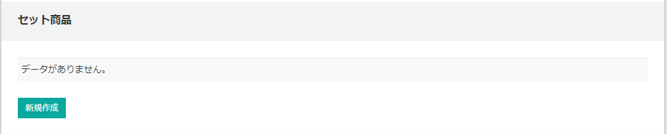

### カテゴリ
カテゴリ情報を表示します。  
[カテゴリの登録](.#カテゴリの登録)に関しては後述します。

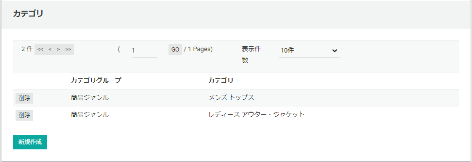

### 基幹在庫連携
基幹在庫連携情報を表示します。  
[基幹在庫連携の登録](.#基幹在庫連携の登録)に関しては後述します。

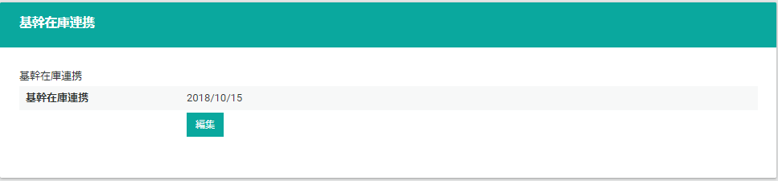

### 指定引当日
指定引当日を表示します。  
[指定引当日の登録](.#指定引当日の登録)に関しては後述します。

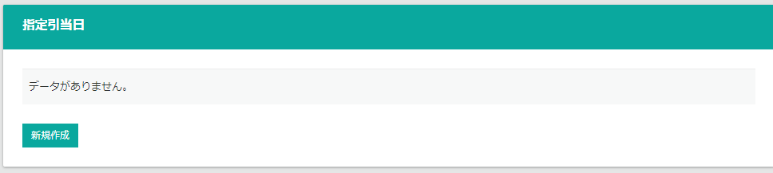

## セット商品の登録
**商品区分**を**セット品**として登録されている商品を、**セット子商品**として登録します。  
セット子商品の登録には以下の項目を指定します。

- **商品型番**
- **商品枝番**
- **数量**: この商品のセット品点数
- **按分価格（合計）**: この商品の按分価格。数量が複数の場合は合計金額を入力

セット商品は複数登録可能です。  
新たセット子商品を追加する場合は**新規登録**ボタンより登録してください。

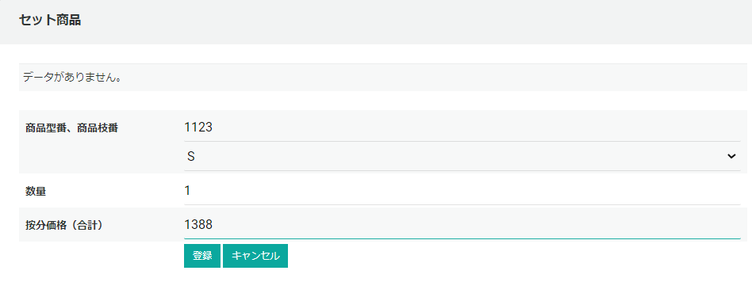

セット子商品の登録が完了しました。登録後に削除も可能です。

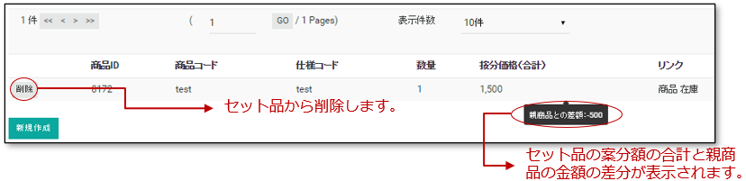

## カテゴリの登録
商品に対して、カテゴリを登録します。商品には複数のカテゴリを登録できます。

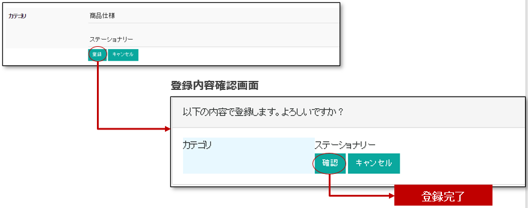

カテゴリの登録が完了しました。登録後に削除も可能です。

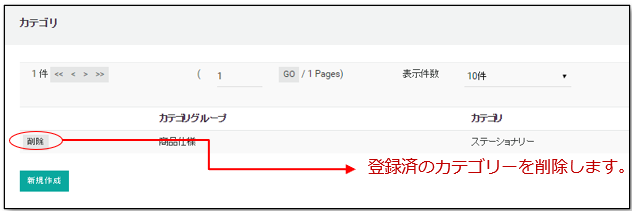

## 基幹在庫連携の登録
商品に対し、基幹在庫連係を開始する日付を設定します。  
設定した日付は、基幹在庫との連携バッチ処理などの制御に使用されます。

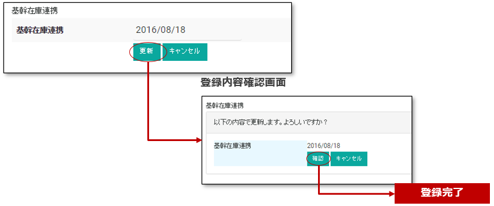

## 指定引当日の登録
商品に対し、引当や本オーソリーを実行する日付を設定します。指定引当日は複数件登録可能です。  
設定した日付は、バッチ処理などの制御に使用されます。

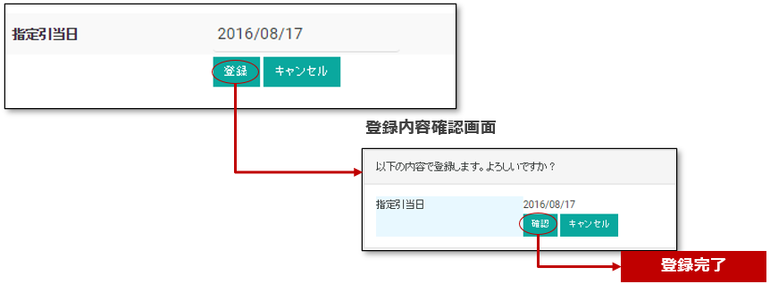

## 一括アップロード
TSVファイルをアップロードして一括でデータを登録します。

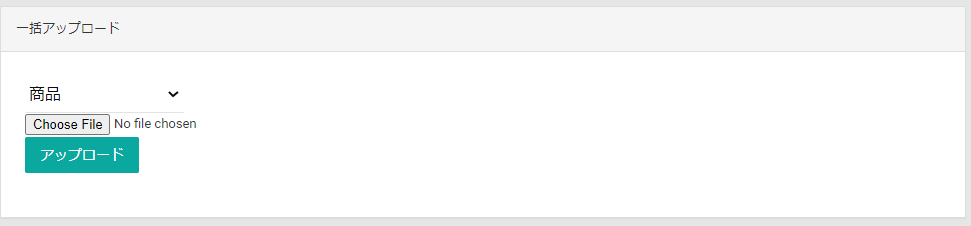

一括アップロードで登録できることは以下になります。

### 商品追加
一括で商品を追加します。[商品追加TSVファイル](.#商品追加tsvファイル)をアップロードします。

### セット商品追加
一括でセット商品を追加します。[セット商品追加TSVファイル](.#セット商品追加tsvファイル)をアップロードします。

### カテゴリ追加
一括で商品にカテゴリを追加します。[カテゴリ追加TSVファイル](.#カテゴリ追加tsvファイル)をアップロードします。

### 商品更新
一括で商品を更新します。[商品更新TSVファイル](.#商品更新tsvファイル)をアップロードします。

### 販売設定更新
一括で商品の販売設定を更新します。[販売設定更新TSVファイル](.#販売設定更新tsvファイル)をアップロードします。

### 商品追加TSVファイル

|     カラム名      | 必須  |       フォーマット       |                                     説明                                     |
| :---------------- | :---: | :----------------------- | :--------------------------------------------------------------------------- |
| ProductType       |   O   | 数値                     | [ProductType](../../../../development/data/enum#producttype)                 |
| ExternalId1       |   O   | `^[^\x00-\x1f]{1,32}$`   | 商品型番・商品コード                                                         |
| ExternalId2       |       | `^[^\x00-\x1f]{1,32}$`   | 商品枝番                                                                     |
| ExternalId3       |       | `^[^\x00-\x1f]{1,32}$`   | 品目コード                                                                   |
| ExternalId4       |       | `^[^\x00-\x1f]{1,32}$`   | JANコード                                                                    |
| ProductName       |   O   | `^[^\x00-\x1f]+{1,128}$` | 商品名                                                                       |
| SetOnly           |   O   | 真偽値                   | セット専売商品フラグ                                                         |
| SalesPatternId    |   O   | 数値                     | 販売パターンのID                                                             |
| DeliveryPatternId |   O   | 数値                     | 配送パターンのID                                                             |
| UnitPrice         |   O   | 数値                     | 単価（税抜）                                                                 |
| TaxationPrice     |   O   | 数値                     | 課税単価（税抜）、もしくは、税額。販売パターンの**税丸めモード**により変動。 |
| SalesStatus       |   O   | 数値                     | [SalesStatus](../../../../development/data/enum#salesstatus)                 |
| SalesStart        |   O   | 日付日時                 | 販売開始日時                                                                 |
| SalesEnd          |       | 日付日時                 | 販売終了日時                                                                 |
| ReleaseDate       |       | 日付日時                 | 発売日                                                                       |
| ReReleaseDate     |       | 日付日時                 | 再販日                                                                       |
| Cero              |       | `[0-4]`                  | CEROレベル                                                                   |

### 商品更新TSVファイル

|     カラム名      |  必須   |       フォーマット       |                                     説明                                     |
| :---------------- | :-----: | :----------------------- | :--------------------------------------------------------------------------- |
| ProductId         |    O    | 数値                     | 内部商品ID                                                                   |
| ProductType       | &Delta; | 数値                     | [ProductType](../../../../development/data/enum#producttype)                 |
| ExternalId1       |         | `^[^\x00-\x1f]{1,32}$`   | 商品型番・商品コード                                                         |
| ExternalId2       |         | `^[^\x00-\x1f]{1,32}$`   | 商品枝番                                                                     |
| ExternalId3       |         | `^[^\x00-\x1f]{1,32}$`   | 品目コード                                                                   |
| ExternalId4       |         | `^[^\x00-\x1f]{1,32}$`   | JANコード                                                                    |
| ProductName       |         | `^[^\x00-\x1f]+{1,128}$` | 商品名                                                                       |
| SetOnly           | &Delta; | 真偽値                   | セット専売商品フラグ                                                         |
| SalesPatternId    | &Delta; | 数値                     | 販売パターンのID                                                             |
| DeliveryPatternId | &Delta; | 数値                     | 配送パターンのID                                                             |
| UnitPrice         | &Delta; | 数値                     | 単価（税抜）                                                                 |
| TaxationPrice     | &Delta; | 数値                     | 課税単価（税抜）、もしくは、税額。販売パターンの**税丸めモード**により変動。 |
| SalesStatus       | &Delta; | 数値                     | [SalesStatus](../../../../development/data/enum#salesstatus)                 |
| SalesStart        | &Delta; | 日付日時                 | 販売開始日時                                                                 |
| SalesEnd          |         | 日付日時                 | 販売終了日時                                                                 |
| ReleaseDate       |         | 日付日時                 | 発売日                                                                       |
| ReReleaseDate     |         | 日付日時                 | 再販日                                                                       |
| Cero              |         | `[0-4]`                  | CEROレベル                                                                   |

&Delta; カラムを用意する場合は必須

### セット商品追加TSVファイル

|    カラム名    | 必須  | フォーマット |     説明     |
| :------------- | :---: | :----------- | :----------- |
| SetProductId   |   O   | 数値         | 親商品ID     |
| ChildProductId |   O   | 数値         | 子商品ID     |
| Amount         |       | 数値         | 子商品の個数 |
| DividePrice    |       | 数値         | 価格の内訳   |

### カテゴリ追加TSVファイル

|  カラム名   |  必須   |       フォーマット       |                                                    説明                                                    |
| :---------- | :-----: | :----------------------- | :--------------------------------------------------------------------------------------------------------- |
| ProductId   | &Delta; | 数値                     | 内部商品ID、付与した場合はこの値が優先される                                                               |
| ExternalId1 | &Delta; | `^[^\x00-\x1f]{1,32}$`   | 商品型番・商品コード、ExternalId2とセットで商品を決定する。ProductIdが指定されている場合はそちらを優先する |
| ExternalId2 | &Delta; | `^[^\x00-\x1f]{1,32}$`   | 商品枝番、ExternalId1とセットで商品を決定する。ProductIdが指定されている場合はそちらを優先する             |
| ExternalId3 |         | `^[^\x00-\x1f]{1,32}$`   | 品目コード                                                                                                 |
| ExternalId4 |         | `^[^\x00-\x1f]{1,32}$`   | JANコード                                                                                                  |
| ProductName |         | `^[^\x00-\x1f]+{1,128}$` | 商品名                                                                                                     |
| CategoryId  |    O    | 数値                     | カテゴリID                                                                                                 |

### 販売設定更新TSVファイル

|        カラム名         |  必須   |       フォーマット       |                                                     説明                                                     |
| :---------------------- | :-----: | :----------------------- | :----------------------------------------------------------------------------------------------------------- |
| ProductId               | &Delta; | 数値                     | 内部商品ID、付与した場合はこの値が優先される                                                                 |
| ExternalId1             | &Delta; | `^[^\x00-\x1f]{1,32}$`   | 商品型番・商品コード、ExternalId2とセットで商品を決定する ProductIdが指定されている場合はそちらを優先する |
| ExternalId2             | &Delta; | `^[^\x00-\x1f]{1,32}$`   | 商品枝番、ExternalId1とセットで商品を決定する。ProductIdが指定されている場合はそちらを優先する               |
| ExternalId3             |         | `^[^\x00-\x1f]{1,32}$`   | 品目コード                                                                                                   |
| ExternalId4             |         | `^[^\x00-\x1f]{1,32}$`   | JANコード                                                                                                    |
| ProductName             |         | `^[^\x00-\x1f]+{1,128}$` | 商品名                                                                                                       |
| TaxRoundMode            |         | 数値                     | 税丸めモード [TaxRoundMode](../../../../development/data/enum#taxroundmode)                                  |
| EnableUserCancel        |         | 真偽値                   | ユーザーキャンセル                                                                                           |
| PointChargeRate         |         | 数値                     | ポイント付与率                                                                                               |
| SinglePurchaseOnly      |         | 数値                     | 単品購入制限                                                                                                 |
| MaxPurchasePerAccount   |         | 数値                     | ユーザー最大購入数                                                                                           |
| MaxPurchasePerOrder     |         | 数値                     | 注文最大購入数                                                                                               |
| MaxMailDeliveryPerOrder |         | 数値                     | メール便最大購入数                                                                                           |
| EnableReserveOrder      |         | 真偽値                   | 仮予約                                                                                                       |
| MaxReserveRequestAmount |         | 数値                     | 最大仮予約確保数                                                                                             |

