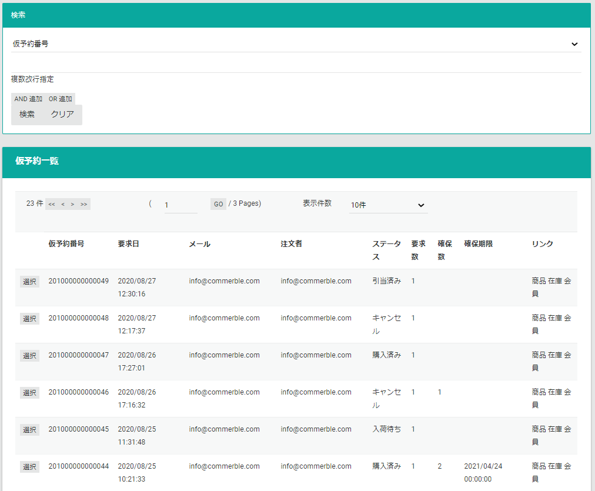

# 仮予約
仮予約ページでは、仮予約情報を閲覧・管理します。  
仮予約の仕様は[こちら](../../../reserve-order) をご参照ください。

## 仮予約検索
検索条件を指定して仮予約を一覧表示します。

## 仮予約情報
仮予約一覧で選択した仮予約情報を表示します。  
**編集**ボタンを押下することで編集できます。

## 一括アップロード
TSVファイルをアップロードして一括でデータを登録します。

一括アップロードで登録できることは以下になります。

### 仮予約キャンセル
仮予約を一括でキャンセルします。[仮予約TSVファイル](.#仮予約tsvファイル)をアップロードします。  
仮予約キャンセルができるのは、ステータスが**入荷待ち**か**引当済み**の仮予約のみです。

### 仮予約TSVファイル

|     カラム名     | 必須  | フォーマット |    説明    |
| ---------------- | :---: | ------------ | ---------- |
| ReserveRequestId |   O   | 数値         | 仮予約番号 |

