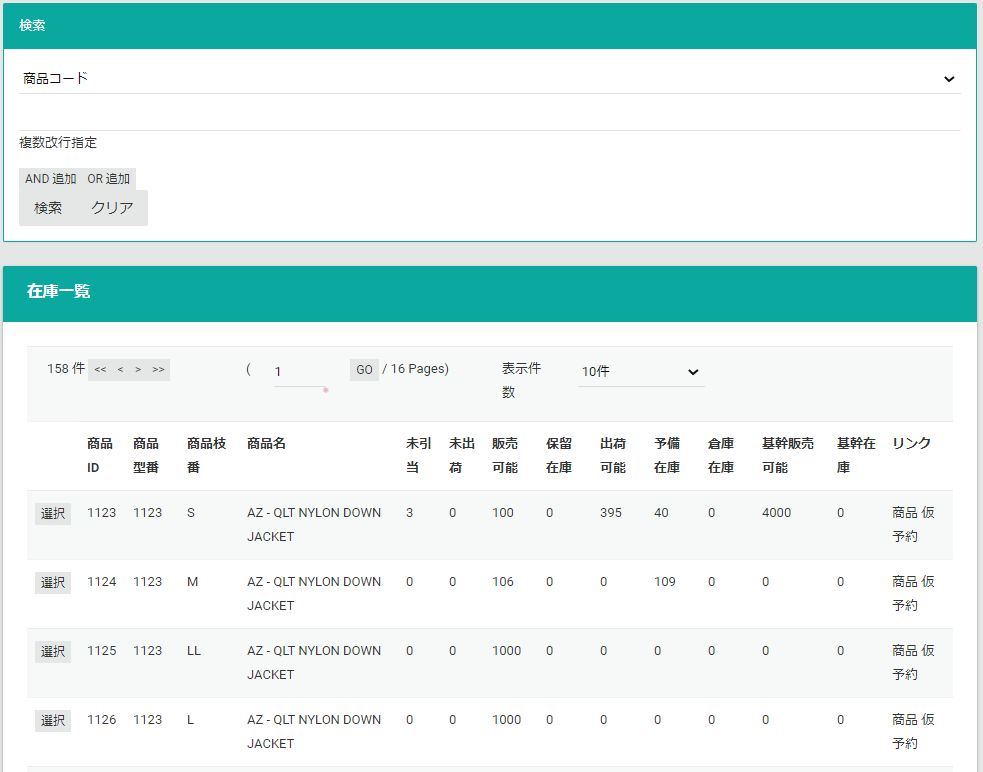
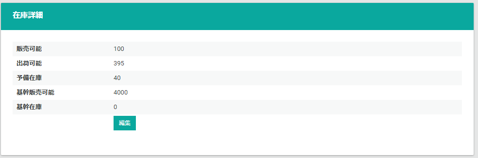
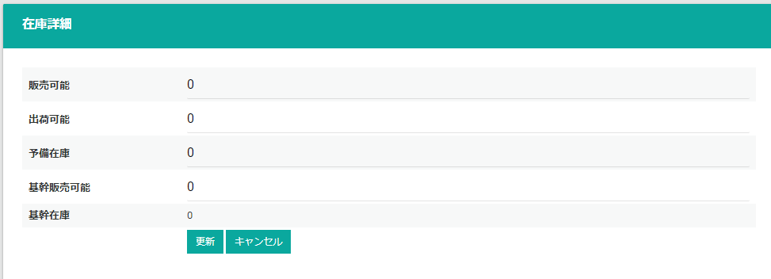
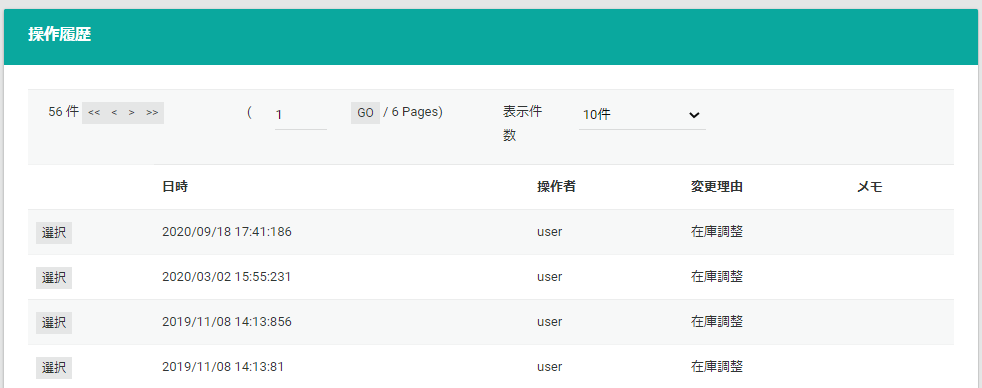

商品の在庫、引当数の閲覧、調整します。  
在庫情報は商品の作成と同時に作成されます。

## 在庫検索
検索条件を指定して、商品在庫を一覧表示します。

|      カラム名      |                     説明                                                    |
| :----------------- |  :------------------------------------------------------------------------ |
| 未引当 | SUM(受注明細.受注数 - 受注明細.引当数) WHERE 受注明細.受注明細タイプ IN (通常,特典,セット子,追加商品) AND 受注.受注ステータス IN (受注,未引当,中途引当,引当済) |
| 未出荷 | SUM(受注明細.引当数) WHERE 受注明細.受注明細タイプ IN (通常,特典,セット子,追加商品) AND 受注.受注ステータス IN (受注,未引当,中途引当,引当済) |
| 販売可能 | 販売可能数.販売可能数 |
| 保留在庫 | 仮予約在庫数.数量 |
| 出荷可能 | 配送可能在庫.在庫数 |
| 予備在庫 | 配送可能在庫.予約数 |
| 倉庫在庫 | 販売可能在庫.倉庫在庫数 |
| 基幹販売可能 | 外部在庫数.総量 |
| 基幹在庫 | 外部在庫数.残量 |

## 在庫情報
在庫一覧で選択した、在庫情報を表示します。
**編集**ボタンより、在庫の変更が可能です。

## 在庫編集
在庫を編集します。  
在庫の**加減値**を入力します。（加算する場合は正数、減算する場合は負数で入力）  
変更を必要としない項目は、`0` を入力してください。

## 操作履歴
在庫の操作履歴を表示します。

## 一括アップロード
在庫を一括で更新します。[在庫TSVファイル](.#在庫TSVファイル)をアップロードします。

### 在庫TSVファイル

|      カラム名      |  必須   |       フォーマット       |                                                    説明                                                    |
| :----------------- | :-----: | :----------------------- | :--------------------------------------------------------------------------------------------------------- |
| ProductId          | &Delta; | 数値                     | 内部商品ID、付与した場合はこの値が優先される                                                               |
| ExternalId1        | &Delta; | `^[^\x00-\x1f]{1,32}$`   | 商品型番・商品コード、ExternalId2とセットで商品を決定する。ProductIdが指定されている場合はそちらを優先する |
| ExternalId2        | &Delta; | `^[^\x00-\x1f]{1,32}$`   | 商品枝番、ExternalId1とセットで商品を決定する。ProductIdが指定されている場合はそちらを優先する             |
| ExternalId3        |         | `^[^\x00-\x1f]{1,32}$`   | 品目コード                                                                                                 |
| ExternalId4        |         | `^[^\x00-\x1f]{1,32}$`   | JANコード                                                                                                  |
| ProductName        |         | `^[^\x00-\x1f]+{1,128}$` | 商品名                                                                                                     |
| StoreSaleAmount    |    O    | 数値                     | 店舗販売可能数、増減値 (0: 変動なし、+100: 100個在庫加算, -100: 100個在庫減算)                             |
| StoreStockAmount   |    O    | 数値                     | 店舗出荷可能数、増減値 (0: 変動なし、+100: 100個在庫加算, -100: 100個在庫減算)                             |
| StoreReserveAmount |    O    | 数値                     | 店舗予備在庫、増減値 (0: 変動なし、+100: 100個在庫加算, -100: 100個在庫減算)                               |

