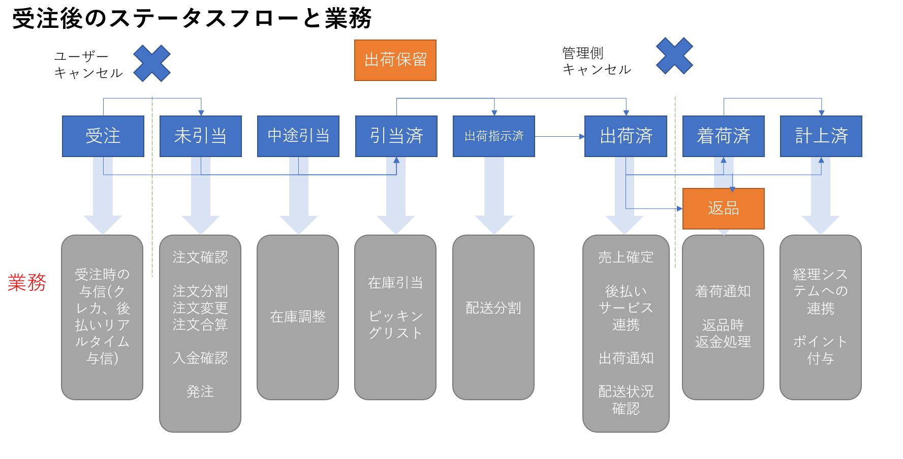

ここではCommerbleの受注情報に関して説明します。

## 受注ステータス
受注ステータスは受注の状態を表します。
一般的に受注ステータスにより、可能なアクション・運用業務が決まります。  
以下に受注ステータスと業務の流れを記載します。

Commerbleでは以下に記載する受注ステータスがあります。  
サイトは全ての受注ステータスを利用する必要はなく、業務に応じて適切に利用する受注ステータスを選択してください。  
多くのテナント様は、受注、出荷指示済、出荷済、計上済、キャンセルのステータスのみを利用して運用しています。

| 受注ステータス |                      説明                      |
| -------------- | ---------------------------------------------- |
| 受注           | ECサイトで注文を受けた状態                     |
| 未引当         | 受注した商品の全ての在庫が未引当の状態         |
| 中途引当       | 受注した商品の一部の在庫が未引当・引当済の状態 |
| 引当済         | 受注した商品の全ての在庫が引当済の状態         |
| 出荷指示済     | 受注の出荷作業をはじめた状態                   |
| 出荷済         | 受注の出荷が済んだ状態                         |
| 着荷済         | 商品がお客様に配達された状態                   |
| 計上済         | 受注の売上が確定した状態                       |
| キャンセル     | 受注がキャンセルされた状態                     |
| 出荷保留       | 何かしらの理由により出荷を停止している状態     |

受注ステータスに関する業務に関しては、 [受注後のステータスフロー](../../../ecspec/orderstatus/) をご参照ください。

## Q. 返品時に在庫を戻すことはできますか
EC管理サイトの [受注管理](../admin/ec/order/) から返品処理を行うことができます。  
全返品の場合は、返品処理で在庫を一緒に戻すことができますが、一部返品の場合は在庫を手動で調整する必要があります。

## Q. 受注した商品の納期が異なる場合、受注を分割出来ますか
受注分割の方法は、自動で行う方法と手動で行う方法があります。  
自動で行う方法は、商品情報に納期情報を用意してECサイトで受注後にバックエンドプログラムで受注分割を行います。  
手動で行う方法は、EC管理サイトの [受注管理](../admin/ec/order/) で受注の複製や、受注インポートを行い生成します。  
またはWeb APIを利用するカスタム管理ツールを作成して、受注分割をする機能を用意できます。

## Q. 受注のユーザーによるキャンセルは可能ですか
[受注ステータス](#受注ステータス) が *未引当* より前のステータスの場合、ユーザーが注文履歴画面より
キャンセル可能です。  
サイトの設定でユーザーによる受注のキャンセルを出来なくする、特定商品はキャンセル不可にするということも可能です。

## Q. 受注商品毎のユーザーキャンセルは可能です
特定の受注商品をユーザーが注文履歴よりキャンセルすることは出来ません。  
EC管理サイトより運営者が、受注を編集して一部受注商品をキャンセル可能です。

## Q. 同一ユーザーの複数受注を合算することは可能ですか
ユーザーは注文履歴からはできません。  
EC管理サイトで対象の受注データを調整し、合算されたような受注にすることは出来ます。  
Web APIを利用するカスタム管理ツールを作成することで、決済方法も自動的に考慮するような受注合算をする事が出来るようになります。

## Q. 受注ステータスのカスタマイズは可能ですか
[受注ステータス](#受注ステータス) はシステム固定でステータスの追加などカスタマイズすることは出来ません。

## Q. 受注情報はどのような情報を保存できますか
標準で受注情報は、注文者情報、配送先情報、受注商品情報、支払情報を持ちます。  
またサイトに特化した受注のデータを保持できます。

## Q. 外部決済サイトで支払中に在庫が横取りされることはありますか
支払い手段によって外部の決済サイトで支払を行う場合がありますが、外部決済サイトで時間が掛っても在庫が横取りされて
購入できなくなるということはありません。  
ただしユーザーは外部決済サイトで支払を意図的に辞める事があるため、Commerbleでは外部決済サイトでの支払を待機する時間を設定しています。待機する時間は決済方法により調整可能です。

