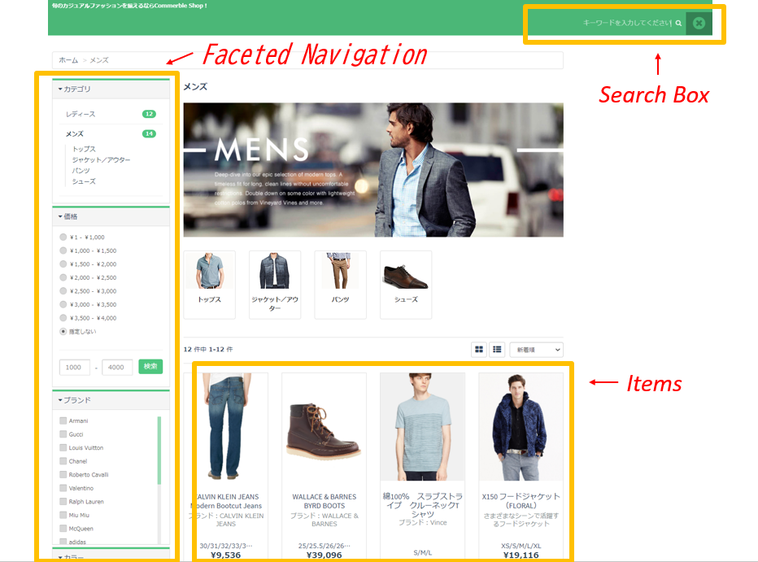

CommerbleではECサイトの要件に応じて、Commerble標準の検索機能か外部検索サービスを利用するかを決定しています。  

## Commerble標準の検索機能はありますか？
あります。Commreble標準の検索機能は、シンプルな要件に対応した検索機能です。  
以下は外部の検索サービスとの対比表です。

|                                    |               Commerble標準検索                | 外部検索サービス |
| ---------------------------------- | :--------------------------------------------: | :--------------: |
| 商品ページ上限(not SKU)            | 約3,000件[1](#note1) |     制限なし     |
| 品番絞込                           |                       〇                       |        〇        |
| 商品名絞込                         |                       〇                       |        〇        |
| カテゴリー・商品タイプ絞込         |                       〇                       |        〇        |
| 在庫有無絞込                       |                       〇                       |        〇        |
| ファセット・ナビゲーション表示     |                       〇                       |        〇        |
| ファセット・ナビゲーション件数表示 |                       ×                        |        〇        |
| 商品名順表示                       |                       〇                       |        〇        |
| 新着順表示                         |                       〇                       |        〇        |
| 価格順表示                         |                       〇                       |        〇        |
| 人気（注文数・売上）順表示         |                       〇                       |        〇        |
| サジェスト機能                     |     △[2](#note2)     |        〇        |
| 高度なテキスト処理                 |                       ×                        |        〇        |
| 表記ゆれ（同義語・類義語）対応     |                       ×                        |        〇        |
| 辞書登録機能                       |                       ×                        |        〇        |
| もしかして検索、オートコレクト機能 |                       ×                        |        〇        |

<small id="note1">1. 商品ページ上限は、検索の要件に応じて変動します。</small>  
<small id="note2">2. シンプルなサジェスト機能の提供は可能。</small>

## 外部の検索サービスを導入することは可能ですか？
可能です。高機能な検索機能をECサイトに設置したい場合、外部の検索サービスの導入を推奨しています。  

## 外部検索サービスの導入実績

- ポップリンク(BST)
- ポップファインド(BST)
- probo(BST)
- SLI
- NaviPlusサーチ
- テナント独自検索サービス
