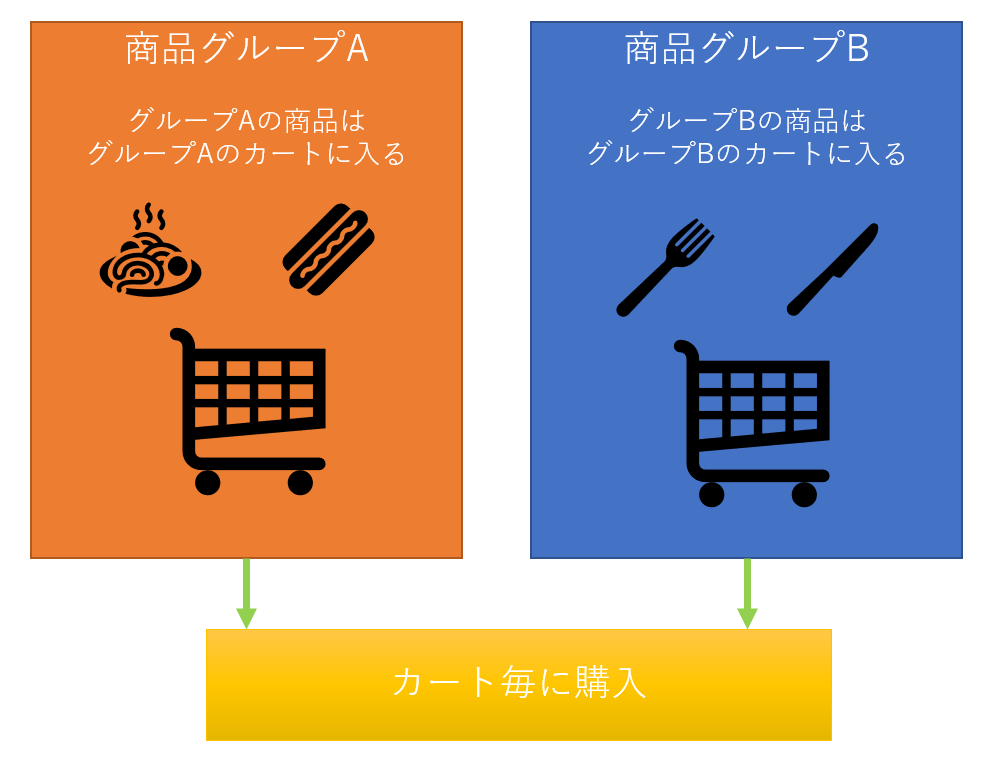

# 購入フロー

## 商品の購入制限はできますか？
Commerbleでは商品の購入制限の方法がいくつかあります。

### 購入数量制限
- 一度に購入できる数量を制限
- 会員毎に購入できる数量を制限

### 単品購入制限
- 他の商品と同時に購入することを制限

### 会員・会員属性による制限
- 会員のみ購入可能
- 特定ランクの会員のみ購入可能

## 特定の商品を同じカートに入れられないようにする事は可能ですか？
上記で説明した単品購入制限でも可能であり、カスタマイズで商品属性に応じて同時に購入できる商品を制御することもできます。  
複数店舗・ブランドの商品をECサイトで扱っており、配送を店舗・ブランド毎に行いたい場合はマルチカート機能の利用が適しています。

### マルチカート機能
商品をグループ分けして、特定グループの商品はそのグループ専用のカートに分配することができます。この機能を利用することにより、同時に購入できる商品を同一グループのみに制御することができます。

## かご落ち防止機能のようなものはありますか？
かご落ちは、ユーザーが購入を完了する前にカートを離脱してしまうことです。
ECサイトのかご落ち率は約70%と言われています。
かご落ちの主な原因に対してCommerbleでは以下の対応が可能です。

### 購入時の入力が煩わしい
Commerbleでは購入フローで入力する情報を、会員情報より補完し最低限の入力のみで購入できるように調整できます。
入力フォームの構成をカスタマイズできますので、サイトの要件に合わせたフォームをご提供可能です。
またゲスト購入向けには Amazon Pay など配送先情報、決済情報を入力しなくても購入できる決済サービスと導入しスムーズな購入を提供することができます。

### 追加費用（送料・手数料）や支払金額がわかりずらい
Commerbleでは全てのページのデザインがカスタマイズできます。
そのため購入フローの早い段階で支払金額の目安を表示するなどカスタマイズすることができます。
但し追加費用（送料・手数料）の計算が複雑な場合など、必ずしも早期に価格表示を出来ない場合もあります。
追加費用の計算をシンプルなものにする（全国一律）などユーザーが分かりやすい仕様にすることも大切です。

### 購入完了までのプロセスが長い
Commerbleでは会員情報や購入商品に応じて、購入フローをスキップできるダイレクトカートインという機能があります。
この機能を利用することにより、より手数の少ない購入フローを提供することができます。

他にも「配送が思っていたより遅い」、「支払方法の選択肢が少ない」、「サイトのレスポンスが悪い」などかご落ちの原因はありますが
Commerbleではサイトを最適化し、かご落ち率を下げることが出来ます。  

またカートの永続化機能を利用することで、かご落ちしてしまった会員が再訪問した時に前回カートに入れた商品を確認できますので、購入に繋がる可能性を高めることができます。

## 購入ステップは省略できますか？
ダイレクトカートイン機能を利用することにより購入ステップのカスタマイズができます。
例えば、配送情報を登録済の会員の場合は配送情報入力ページをスキップするように調整することができます。
