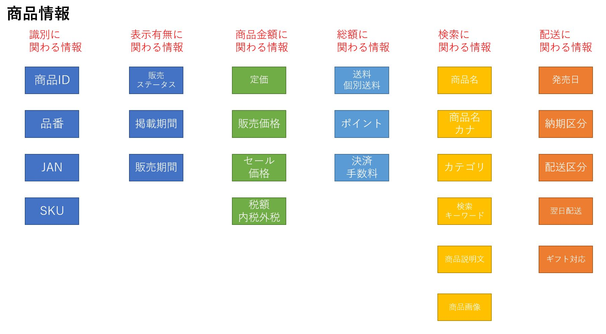

# 商品
## 基本仕様

## 在庫、取り寄せ、予約、受注生産、定期の違いで購入フローが異なる
- 在庫商品＝自社倉庫(WMS)から在庫を引当てる。
- 取り寄せ商品＝在庫を管理しているかはあるが、メーカーや卸に発注する形態をとる。
- 予約商品＝発売日に発送する。決済タイミングは業務要件によって購入時もしくは、引き当て時など異なる。
- 受注生産商品＝受注時はカード情報を預かり、入荷情報をもとに決済し、商品を発送していく。
- 定期商品＝カード情報を預かり、N日単位もしくは毎月N日に定期的に決済し、商品を発送する。

## SKU(Stock Keeping Unit)
商品の在庫管理単位。アパレルだと一般的に品番、カラー、サイズ別に在庫を管理する事になる。
業態によって管理方法や複雑度が異なる。
解決策として基本ー中間ー末端のような三層構造にして管理することも考えられる。

| 品番 | カラー | サイズ | 在庫数 |
|:-----------|------------:|:------------:|:------------:|
| nk17-880553| ブラック×ホワイト | 26.0cm | 7 |
| nk17-880553| ブラック×ホワイト | 26.5cm | 8 |
| nk17-880553| ブラック×ホワイト | 27.0cm | 9 |
| nk17-880553| ブルー | 26.0cm | 6 |
| nk17-880553| ブルー | 26.5cm | 8 |
| nk17-880553| ブルー | 27.0cm | 10 |
※在庫はEC在庫以外に店舗別在庫もあり、どう仕様を表現するか考える。

## 重要な仕様
- 商品カテゴリ
- 商品タグ
- プレゼント商品(カートに同梱するような形をとるか、配送時に倉庫側で追加するか)
- セット商品(商品AとBをセット商品Cとした場合の在庫の考え方をどうするか)

## デジタルコンテンツ
- 在庫無制限。
- 即売上確定。
- 閲覧権限を別途管理しなくてはいけない。

## 外部連携
- 商品は基幹システムと連携するか、基幹からの一方通行なのか。
- 在庫はECのみでの管理か、物流倉庫と連携するか
- 商品データの連携用フォーマットはどうするか※CSVなどで外部システムからデータをもらうのが一般的
- 連携用フォーマットには、コントロールカラム(新規修正削除をコントロールするカラム)が必要
- 連携用フォーマットは横にカラムが伸びがちなので、必要最低限なものと、付加情報で分けられるとよい。

## 商品項目例
商品の項目例を記載する。

### 商品項目例(よくあるケース)
- 商品番号	品番
- JAN(国際標準はGTIN-13・EAN-13、インハウスJAN)
- 商品名
- 商品名(カナ)
- カテゴリ(N件)
- キャプション	
- 販売ステータス
- 定価価格	定価(内税、外税)
- 販売価格	実際の販売価格(内税、外税)
- セール価格	セール時の販売価格(内税、外税)
- 消費税　消費税額を別途管理する場合	
- 送料区分	共通の送料、個別送料有、送料無料
- 個別送料	予め指定した送料以外に指定する場合の値、直接金額を入力する
- 代引料(システムで一括が一般的)
- ギフト対応(対応する、しない)
- 商品説明文	=HTML、平文
- 商品画像URL、説明文ALT(N件)
- 掲載期間指定＝掲載可能な期間
- 販売期間指定＝購入可能な期間※予約商品の場合は、予約受付期間
- 予約商品発売日	
- 注文受付数	商品カートに入れられる数を指定する値。1なら一回の注文で1個しかカートに入れられない。
- 在庫タイプ＝JANが一つしかないケース、SKU別に在庫を管理するケース
- 在庫数	
- 検索キーワード(表示しないが検索にかかるようにする)
- メタ説明文
- 翌日配達可否
- 在庫切れ時の注文受付可否(受け付ける、受け付けない)
- 納期区分(在庫ありの場合)
- 納期区分(在庫なしの場合)
- 配送方法区分(1：宅配便のみ　2：宅配便、ネコポス　3：宅配便、ネコポス、EMS　4：宅配便、EMS)

### 商品項目例(オプション)
- 原価
- 仕入れ価格
- 販売単位記号(個、本、冊)

